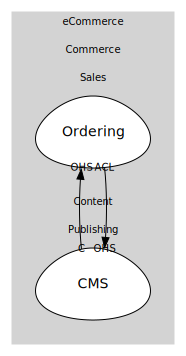

# Context Map

By using the `ODSContextMap` class, you can create a context map that defines bounded contexts and their relationships. The `contextMapToDigraph` function converts this map into a Graphviz digraph.

This will produce the following SVG diagram:



```ts file=../../tests/context-map.example.test.ts
```
