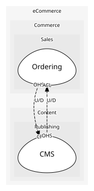

# Context Map

By using the `ODSContextMap` class, you can create a context map that defines bounded contexts and their relationships. The `contextMapToDigraph` function converts this map into a Graphviz digraph.

Every context in scope is a node, labelled with its owning team and marked
when it is a big ball of mud. Declared relationships are solid edges;
directed ones point from upstream to downstream with the roles as tail and
head labels (`OHS`, `PL`, `CF`, `ACL`), symmetric ones have no arrowhead.
Relationships implied from consumptions are dashed.

This will produce the following SVG diagram:



```ts file=../../tests/context-map.example.test.ts
```
