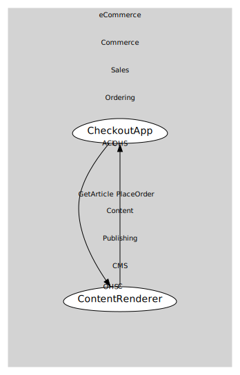

# Consumer Map

By using the `ODSConsumableMap` class, you can create a consumer map that defines consumables and consumers and their relationships. The `consumableMapToDigraph` function converts this map into a Graphviz digraph.

This will produce the following SVG diagram:



```ts file=../../tests/consumer.example.test.ts
```
