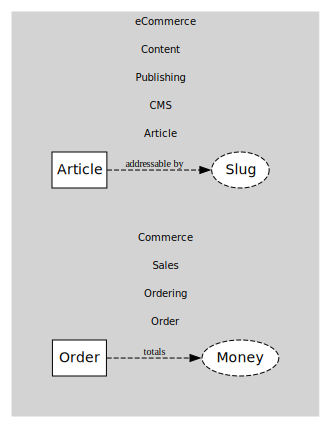

# Relationship Map

By using the `ODSRelationMap` class, you can create a relation map that defines Entities, ValueObjects and their relationships. The `relationMapToDigraph` function converts this map into a Graphviz digraph.

This will produce the following SVG diagram:



```ts file=../../tests/relationship.example.test.ts
```
