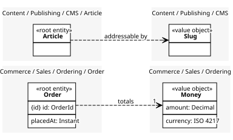

# Relationship Map

The `ODSRelationMap` class collects the entities, value objects and relations
in scope. Where DDD has no notation of its own, ODS uses UML, so
`relationMapToDigraph` draws the map as a UML class diagram:

- each entity or value object is a class box with a stereotype («root entity»,
  «entity» or «value object»), its name and an attribute compartment, with
  identity attributes marked `{id}`;
- `references` is a navigable association (solid line, open arrowhead),
  `includes` is a composition (filled diamond on the owner) and `uses` is a
  dependency (dashed line, open arrowhead);
- the relation label sits on the line and the cardinality at the target end;
- classes are grouped in one cluster per aggregate, labelled with its
  domain, subdomain and bounded context path.

`toPlantUML()` returns the same diagram as PlantUML class diagram source for
teams that already render PlantUML with their own tooling. ODS does not render
PlantUML itself, see decision 10 in the repository.

This will produce the following SVG diagram:



```ts file=../../tests/relationship.example.test.ts
```
