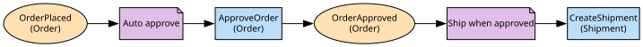

# Flow Map

The `ODSFlowMap` class walks from the policies in scope to the event
consumables they react to, the operation consumables they issue and the
events those operations raise. The `flowMapToDigraph` function draws it left
to right: events as ellipses, policies as notes, operations as boxes.



```ts file=../../tests/flow-map.example.test.ts
```
