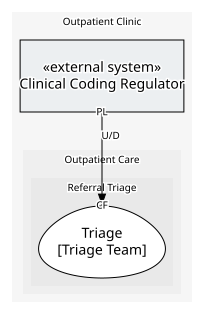

# Clinical Coding Regulator
> **External system.** A system the enterprise does not own: only what it provides and consumes is modelled here, never its insides.

Publishes the national clinical coding standard every clinical record must follow. Offers nothing to call: only the standard itself, as data.

## Serves
> No subdomains.

## Glossary
> No glossary terms.

## Aggregates
> No aggregates.
	
## Services
> No services.

## Invariants
> No invariants across aggregates.

## Value Objects
| Name | Description | Attributes | Invariants | Used by |
| --- | --- | --- | --- | --- |
| Clinical Code | A single code from the current published coding standard, and the version of the standard it was taken from. | code: `string`, codeSetVersion: `string` | Code Belongs To The Published Standard: A clinical code is only ever one the regulator's current coding standard actually lists. | - |

## Schemas
> No schemas.

## Policies
> No policies.

## Processes
> No processes.

## Context Relationships
### Depended on by
| With | Description | Type | Upstream Roles | Downstream Roles |
| --- | --- | --- | --- | --- |
| Triage | Every accepted referral's diagnosis must carry a code from the regulator's published coding standard, taken as it is published. | upstream-downstream | published-language | conformist |

- `conformist` — **Conformist** (CF). Downstream adopts the upstream domain model without translation.
- `published-language` — **Published Language** (PL). A well-documented shared interchange format.
- `upstream-downstream` — **Upstream/Downstream** (U/D). One context depends on another; the upstream does not plan around the downstream.

## Consumptions

