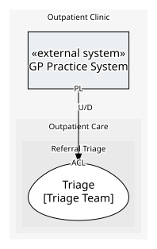

# GP Practice System
> **External system.** A system the enterprise does not own: only what it provides and consumes is modelled here, never its insides.

The GP's own practice management system. Not ours to model inside: it sends referrals in its own message format, and every practice may run a different one.

## Serves
> No subdomains.

## Glossary
> No glossary terms.

## Aggregates
> No aggregates.
	
## Services

### [Practice System Interface](services/practice_system_interface/index.md)
What the practice system publishes to us.

## Invariants
> No invariants across aggregates.

## Value Objects
> No value objects.

## Schemas
| Name | Description | Attributes | Used by |
| --- | --- | --- | --- |
| GP Referral Message | The referral exactly as the practice system sends it. | **referralReference**: `string`, gpPatientNumber: `string`, requestedSpecialty: `string`, urgency: `string`, clinicalSummary: `string` | Referral Submitted |

## Policies
> No policies.

## Processes
> No processes.

## Context Relationships
### Depended on by
| With | Description | Type | Upstream Roles | Downstream Roles |
| --- | --- | --- | --- | --- |
| Triage | The practice system's referral message is theirs to change; triage translates it into a case of our own on the way in. | upstream-downstream | published-language | anti-corruption-layer |

- `anti-corruption-layer` — **Anti-Corruption Layer** (ACL). A translating boundary isolating a downstream model from external concepts.
- `published-language` — **Published Language** (PL). A well-documented shared interchange format.
- `upstream-downstream` — **Upstream/Downstream** (U/D). One context depends on another; the upstream does not plan around the downstream.

## Consumptions
| Consumer | Made By | Consumed As | Provider | Consumable | Provided As |
| --- | --- | --- | --- | --- | --- |
| [Referral Intake](../triage/services/referral_intake/index.md) | Register Referral On Submission | anti-corruption-layer | Practice System Interface | Referral Submitted | published-language |

