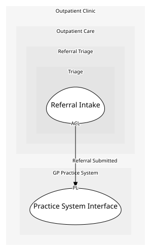

# Practice System Interface
What the practice system publishes to us.

## Provides
| Name | Type | Internal | Pattern | Description | Schema | Returns | Rejects with | Raises | Guarded by |
| --- | --- | --- | --- | --- | --- | --- | --- | --- | --- |
| Referral Submitted | event | no | published-language | A referral has been sent by the GP's practice system, in its own message format. | [GP Referral Message](../../index.md#schemas) | - | - | - | - |

## Consumes
> No consumptions.
	
