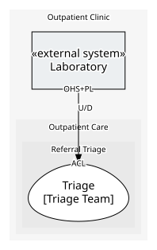

# Laboratory
> **External system.** A system the enterprise does not own: only what it provides and consumes is modelled here, never its insides.

The clinic's contracted laboratory service. Takes a test order and answers with a result later, in its own report format. Not ours to model inside.

## Serves
> No subdomains.

## Glossary
> No glossary terms.

## Aggregates
> No aggregates.
	
## Services

### [Lab Interface](services/lab_interface/index.md)
What the lab offers us, and what it publishes back.

## Invariants
> No invariants across aggregates.

## Value Objects
> No value objects.

## Schemas
| Name | Description | Attributes | Used by |
| --- | --- | --- | --- |
| Test Order Request | The order, in the lab's own terms. | **orderReference**: `string`, testCode: `string`, clinicalNotes: `string` (optional) | Order Test |
| Test Order Accepted | The lab's acknowledgement that it has taken the order. | **orderReference**: `string` | Order Test |
| Lab Result Message | The result, in the lab's own report format. | **orderReference**: `string`, resultCode: `string`, reportText: `string` | Test Result Reported |

## Policies
> No policies.

## Processes
> No processes.

## Context Relationships
### Depended on by
| With | Description | Type | Upstream Roles | Downstream Roles |
| --- | --- | --- | --- | --- |
| Triage | Triage orders tests through the lab's documented interface and translates its own report format into a case's own terms. | upstream-downstream | open-host-service, published-language | anti-corruption-layer |

- `open-host-service` — **Open Host Service** (OHS). A public, stable protocol or API provided by an upstream context.
- `anti-corruption-layer` — **Anti-Corruption Layer** (ACL). A translating boundary isolating a downstream model from external concepts.
- `published-language` — **Published Language** (PL). A well-documented shared interchange format.
- `upstream-downstream` — **Upstream/Downstream** (U/D). One context depends on another; the upstream does not plan around the downstream.

## Consumptions
| Consumer | Made By | Consumed As | Provider | Consumable | Provided As |
| --- | --- | --- | --- | --- | --- |
| [Lab Ordering](../triage/services/lab_ordering/index.md) | - | anti-corruption-layer | Lab Interface | Order Test | open-host-service |
| [Lab Ordering](../triage/services/lab_ordering/index.md) | Record Lab Result On Receipt | anti-corruption-layer | Lab Interface | Test Result Reported | published-language |

