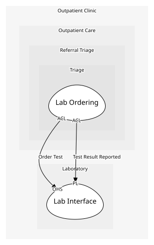

# Lab Interface
What the lab offers us, and what it publishes back.

## Provides
| Name | Type | Internal | Pattern | Description | Schema | Returns | Rejects with | Raises | Guarded by |
| --- | --- | --- | --- | --- | --- | --- | --- | --- | --- |
| Order Test | operation | no | open-host-service | Takes a test order, in the lab's own request shape. | [Test Order Request](../../index.md#schemas) | [Test Order Accepted](../../index.md#schemas) | - | - | - |
| Test Result Reported | event | no | published-language | A result is ready, reported in the lab's own format. | [Lab Result Message](../../index.md#schemas) | - | - | - | - |

## Consumes
> No consumptions.
	
