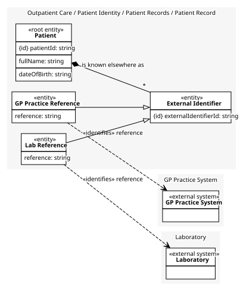

# Patient Record
One patient, and every outside reference we hold for them.

## Entities and Value Objects
| Type | Name | Description | Attributes |
| --- | --- | --- | --- |
| Entity (Root) | **Patient** | Somebody the clinic has, or will, care for. | **patientId**: `string`, fullName: `string`, dateOfBirth: `string` |
| Entity | External Identifier | One outside system's own reference for this patient. Kinds say which system and hold that system's reference. | **externalIdentifierId**: `string` |
| Entity (a kind of External Identifier) | GP Practice Reference | This patient's number in a GP's own practice system. | reference: `string` (identifies [GP Practice System](../../../gp_practice_system/index.md)), **externalIdentifierId**: `string` (from External Identifier) |
| Entity (a kind of External Identifier) | Lab Reference | This patient's reference at the laboratory. | reference: `string` (identifies [Laboratory](../../../laboratory/index.md)), **externalIdentifierId**: `string` (from External Identifier) |

## Relationships
| Source | Description | Target | Relation | Cardinality |
| --- | --- | --- | --- | --- |
| [Patient Record - Patient](./index.md#entities-and-value-objects) | is known elsewhere as | Patient Record - External Identifier | includes | * |

## Invariants
> No invariants.

## Provides
| Name | Type | Internal | Pattern | Description | Schema | Returns | Rejects with | Raises | Guarded by |
| --- | --- | --- | --- | --- | --- | --- | --- | --- | --- |
| Register Patient | operation | no | - | Creates the record for a patient the clinic has not seen before. Called by the records officer, or on the records officer's behalf when a referral names a patient not yet known. | [Patient Details](../../index.md#schemas) | [Patient Summary](../../index.md#schemas) | - | Patient Registered | - |
| Patient Registered | event | no | - | A new patient has been added to Records. | [Patient Details](../../index.md#schemas) | - | - | - | - |
| Link GP Practice Reference | operation | no | - | Records that a GP practice system knows this patient by a given number. Called by the records officer while matching a referral to a patient. | [GP Reference Details](../../index.md#schemas) | - | - | - | One External Reference Per System |
| Link Lab Reference | operation | no | - | Records that the laboratory knows this patient by a given reference. Called by the records officer. | [Lab Reference Details](../../index.md#schemas) | - | - | - | One External Reference Per System |

## Consumes
> No consumptions.
	
