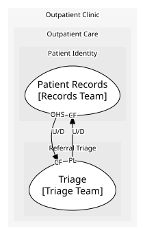
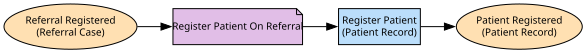

# Patient Records
Holds who our patients are, and what every outside system that refers to them calls them.

**Owned by:** Records Team

## Serves
- [Outpatient Care / Patient Identity](../../domains/outpatient_care/subdomains/patient_identity/index.md) (supporting)

## Glossary
| Term | Definition | Aliases | Embodied by |
| --- | --- | --- | --- |
| **Patient** | Somebody the clinic has, or will, care for. | - | Patient |
| **External Identifier** | The reference an outside system -- a GP practice, the lab -- uses for one of our patients. | - | External Identifier |

## Aggregates

### [Patient Record](aggregates/patient_record/index.md)
One patient, and every outside reference we hold for them.

	
## Services

### [Patient Directory](services/patient_directory/index.md)
Fronts Records for the rest of the clinic.

## Invariants
Rules that hold across this context's instances and aggregates; each names the operation that checks it before acting.

| Name | Description | Constrains |
| --- | --- | --- |
| One External Reference Per System | A patient never holds two references from the same outside system -- if a second one turns up, it is a mistake to catch, not a second identity to keep. | GP Practice Reference, Lab Reference, Link GP Practice Reference, Link Lab Reference |

## Value Objects
> No value objects.

## Schemas
| Name | Description | Attributes | Used by |
| --- | --- | --- | --- |
| Patient Summary | What Records answers with when another part of the clinic looks a patient up. | **patientId**: `string`, fullName: `string`, dateOfBirth: `string` | Register Patient, Get Patient Summary, Check Patient History |
| Patient Lookup Request | Which patient is being asked for. | patientId: `string` | Get Patient Summary |
| Patient Details | What is known about a new patient when they are first registered. | fullName: `string`, dateOfBirth: `string` | Register Patient, Patient Registered |
| GP Reference Details | A patient's GP practice number, to be linked to our own record. | patientId: `string`, gpPatientNumber: `string` (identifies [GP Practice System](../gp_practice_system/index.md)) | Link GP Practice Reference |
| Lab Reference Details | A patient's lab reference, to be linked to our own record. | patientId: `string`, labPatientReference: `string` (identifies [Laboratory](../laboratory/index.md)) | Link Lab Reference |

## Policies

| Name | Description | On | Then |
| --- | --- | --- | --- |
| Register Patient On Referral | Every registered referral names a patient Records should know about, new or existing. | Referral Registered | Register Patient |

## Processes
> No processes.

## Context Relationships
### Depends on
| With | Description | Type | Upstream Roles | Downstream Roles |
| --- | --- | --- | --- | --- |
| Triage | Records takes triage's own registered-case fact as published. | upstream-downstream | published-language | conformist |

### Depended on by
| With | Description | Type | Upstream Roles | Downstream Roles |
| --- | --- | --- | --- | --- |
| Triage | Triage's assessment looks a patient up through Records' own directory and takes what it gets back as published. | upstream-downstream | open-host-service | conformist |

- `open-host-service` — **Open Host Service** (OHS). A public, stable protocol or API provided by an upstream context.
- `conformist` — **Conformist** (CF). Downstream adopts the upstream domain model without translation.
- `published-language` — **Published Language** (PL). A well-documented shared interchange format.
- `upstream-downstream` — **Upstream/Downstream** (U/D). One context depends on another; the upstream does not plan around the downstream.

## Consumptions
| Consumer | Made By | Consumed As | Provider | Consumable | Provided As |
| --- | --- | --- | --- | --- | --- |
| [Triage Assessment](../triage/services/triage_assessment/index.md) | - | conformist | Patient Directory | Get Patient Summary | open-host-service |
| [Patient Directory](services/patient_directory/index.md) | Register Patient On Referral | conformist | Referral Case | Referral Registered | published-language |

