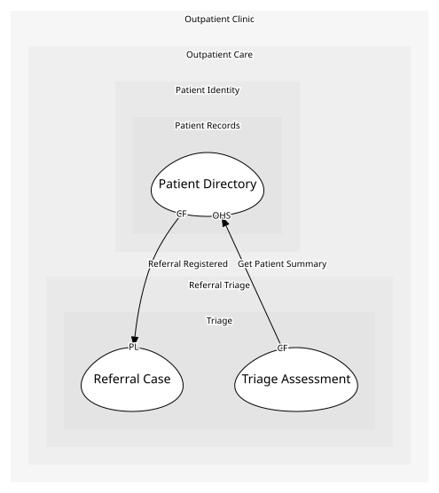

# Patient Directory
Fronts Records for the rest of the clinic.

## Provides
| Name | Type | Internal | Pattern | Description | Schema | Returns | Rejects with | Raises | Guarded by |
| --- | --- | --- | --- | --- | --- | --- | --- | --- | --- |
| Get Patient Summary | operation | no | open-host-service | Looks a patient up by their internal id. | [Patient Lookup Request](../../index.md#schemas) | [Patient Summary](../../index.md#schemas) | - | - | - |

## Consumes

### Referral Registered [conformist]
A referral has become a case of ours.
- **Provider**: [Referral Case](../../../triage/aggregates/referral_case/index.md)
- **Made by**: Register Patient On Referral

	
