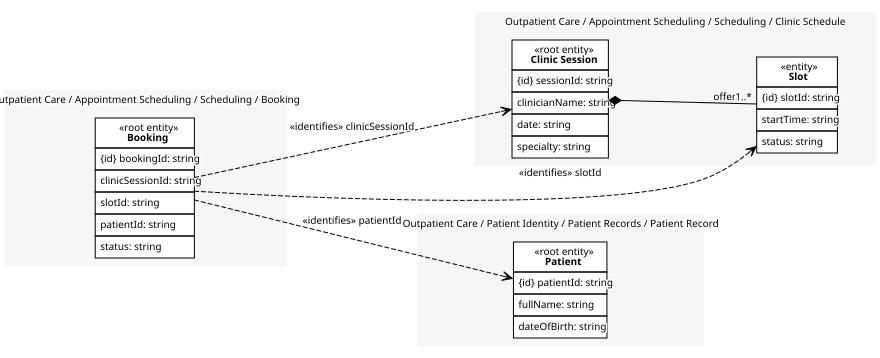

# Booking
One patient booked, or waitlisted, against a slot.

## Entities and Value Objects
| Type | Name | Description | Attributes |
| --- | --- | --- | --- |
| Entity (Root) | **Booking** | A patient's claim on a slot, from an offer through to its outcome. | **bookingId**: `string`, clinicSessionId: `string` (identifies [Clinic Session](../clinic_schedule/index.md)), slotId: `string` (identifies [Slot](../clinic_schedule/index.md)), patientId: `string` (identifies [Patient](../../../patient_records/aggregates/patient_record/index.md)), status: `string` |

## Relationships
| Source | Description | Target | Relation | Cardinality |
| --- | --- | --- | --- | --- |
| [Clinic Schedule - Clinic Session](../clinic_schedule/index.md#entities-and-value-objects) | offers | Clinic Schedule - Slot | includes | 1..* |

## Invariants
> No invariants.

## Provides
| Name | Type | Internal | Pattern | Description | Schema | Returns | Rejects with | Raises | Guarded by |
| --- | --- | --- | --- | --- | --- | --- | --- | --- | --- |
| Booking Confirmed | event | no | - | A patient confirmed the slot they were offered. | [Booking Confirmed](../../index.md#schemas) | - | - | - | - |
| Patient Waitlisted | event | no | - | A patient was put on the waiting list instead of taking the offered slot. | [Patient Waitlisted](../../index.md#schemas) | - | - | - | - |
| Cancel Booking | operation | no | - | Called by the patient or the scheduler to give up a confirmed booking. | [Cancellation Request](../../index.md#schemas) | - | - | Booking Cancelled | - |
| Booking Cancelled | event | no | - | A confirmed booking was cancelled. | [Booking Cancelled Details](../../index.md#schemas) | - | - | - | - |
| Mark Appointment Day Reached | operation | no | - | Called by the clinic's own scheduler once a confirmed booking's clinic session date arrives with no cancellation received; the date is the session's own, already held, not an interval the process counts (see DISCOVERY.md). | [Appointment Day Reached Details](../../index.md#schemas) | - | - | Appointment Day Reached | - |
| Appointment Day Reached | event | no | - | A confirmed booking's clinic session date arrived with no cancellation received. | [Appointment Day Reached Details](../../index.md#schemas) | - | - | - | - |

## Consumes
> No consumptions.
	
