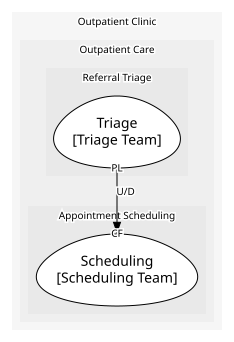
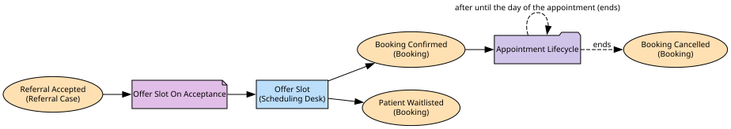

# Scheduling
Turns an accepted case into a booked clinic slot, and keeps the record of clinics, slots, bookings and cancellations.

**Owned by:** Scheduling Team

## Serves
- [Outpatient Care / Appointment Scheduling](../../domains/outpatient_care/subdomains/appointment_scheduling/index.md) (supporting)

## Glossary
| Term | Definition | Aliases | Embodied by |
| --- | --- | --- | --- |
| **Clinic Session** | A run of appointments on a given day with a given clinician. | - | Clinic Session |
| **Slot** | One bookable appointment time within a clinic session. | - | Slot |
| **Booking** | A patient's claim on a slot. | - | Booking |
| **Waitlist** | Where a patient goes when an offered slot does not suit them, to wait for a better one. | - | - |

## Aggregates

### [Clinic Schedule](aggregates/clinic_schedule/index.md)
One clinic session and its bookable slots.

### [Booking](aggregates/booking/index.md)
One patient booked, or waitlisted, against a slot.

	
## Services

### [Scheduling Desk](services/scheduling_desk/index.md)
Offers the patient a slot once triage accepts their case.

## Invariants
Rules that hold across this context's instances and aggregates; each names the operation that checks it before acting.

| Name | Description | Constrains |
| --- | --- | --- |
| Slot Offered Once | A slot is never offered to a second patient while it is already held. | Slot.status, Offer Slot |

## Value Objects
> No value objects.

## Schemas
| Name | Description | Attributes | Used by |
| --- | --- | --- | --- |
| Slot Offer Request | Which accepted case, and which patient, is being offered a slot. | referralId: `string` (identifies [Referral](../triage/aggregates/referral_case/index.md)), patientId: `string` (identifies [Patient](../patient_records/aggregates/patient_record/index.md)) | Offer Slot |
| Booking Confirmed | The patient took the offered slot. | **bookingId**: `string`, slotId: `string`, startTime: `string` | Booking Confirmed, Offer Slot |
| Patient Waitlisted | The offered slot did not suit the patient, so they were put on the waiting list for a better one instead. Something happened here, just not a booking -- the model has no shape for a second thing that happened, so this is carried as a rejection for want of anywhere better (see DISCOVERY.md). | **bookingId**: `string`, note: `string` (optional) | Patient Waitlisted, Offer Slot |
| Booking Cancelled Details | Which booking was cancelled, and why. | reason: `string` (optional) | Booking Cancelled |
| Cancellation Request | Which booking is being cancelled. | reason: `string` (optional) | Cancel Booking |

## Policies

| Name | Description | On | Then |
| --- | --- | --- | --- |
| Offer Slot On Acceptance | Every accepted case is immediately offered a slot. | Referral Accepted | Offer Slot |

## Processes
Reactions that hold state across events: each one remembers which of its events have arrived and says what finishes it.

| Name | Description | Starts | On | Then | Ends |
| --- | --- | --- | --- | --- | --- |
| Appointment Lifecycle | Remembers a confirmed booking until either it is cancelled or the day of the appointment arrives; that is the whole of what a booking waits for. | Booking Confirmed | - | - | Booking Cancelled, Appointment Day Reached (after until the day of the appointment) |

## Context Relationships
### Depends on
| With | Description | Type | Upstream Roles | Downstream Roles |
| --- | --- | --- | --- | --- |
| Triage | Scheduling reacts to triage's own accepted-case fact, taking it as published. | upstream-downstream | published-language | conformist |

- `conformist` — **Conformist** (CF). Downstream adopts the upstream domain model without translation.
- `published-language` — **Published Language** (PL). A well-documented shared interchange format.
- `upstream-downstream` — **Upstream/Downstream** (U/D). One context depends on another; the upstream does not plan around the downstream.

## Consumptions
| Consumer | Made By | Consumed As | Provider | Consumable | Provided As |
| --- | --- | --- | --- | --- | --- |
| [Scheduling Desk](services/scheduling_desk/index.md) | Offer Slot On Acceptance | conformist | Referral Case | Referral Accepted | published-language |

