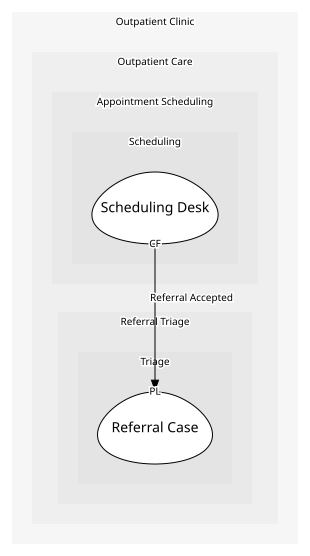

# Scheduling Desk
Offers the patient a slot once triage accepts their case.

## Provides
| Name | Type | Internal | Pattern | Description | Schema | Returns | Rejects with | Raises | Guarded by |
| --- | --- | --- | --- | --- | --- | --- | --- | --- | --- |
| Offer Slot | operation | no | - | Offers the patient the next open slot for the case's specialty. The patient's answer is not a refusal either way -- see DISCOVERY.md for why the second outcome is carried under rejects. | [Slot Offer Request](../../index.md#schemas) | [Booking Confirmed](../../index.md#schemas) | [Patient Waitlisted](../../index.md#schemas) | Booking Confirmed, Patient Waitlisted | Slot Offered Once |

## Consumes

### Referral Accepted [conformist]
A case has been accepted and is ready to be scheduled.
- **Provider**: [Referral Case](../../../triage/aggregates/referral_case/index.md)
- **Made by**: Offer Slot On Acceptance

	
