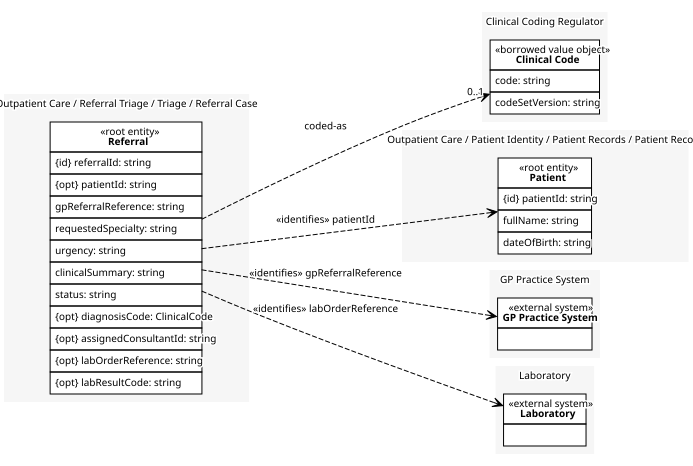
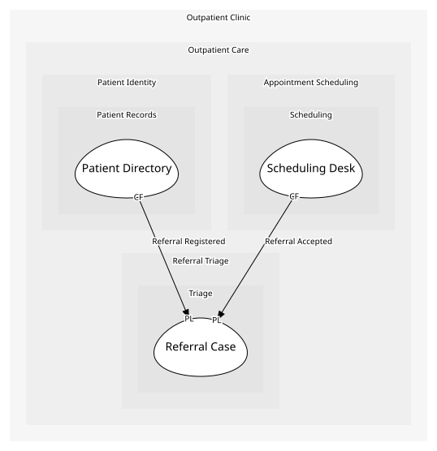

# Referral Case
One referral, from the moment it becomes a case of ours.

## Entities and Value Objects
| Type | Name | Description | Attributes |
| --- | --- | --- | --- |
| Entity (Root) | **Referral** | A GP referral, once it is a case of ours rather than the GP's message. | **referralId**: `string`, patientId: `string` (optional) (identifies [Patient](../../../patient_records/aggregates/patient_record/index.md)), gpReferralReference: `string` (identifies [GP Practice System](../../../gp_practice_system/index.md)), requestedSpecialty: `string`, urgency: `string`, clinicalSummary: `string`, status: `string`, diagnosisCode: `ClinicalCode` (optional), assignedConsultantId: `string` (optional), labOrderReference: `string` (optional) (identifies [Laboratory](../../../laboratory/index.md)), labResultCode: `string` (optional) |
| Value Object | [Clinical Code](../../../clinical_coding_regulator/index.md#value-objects) | A single code from the current published coding standard, and the version of the standard it was taken from. | code: `string`, codeSetVersion: `string` |

## Relationships

## Invariants
| Name | Description | Constrains |
| --- | --- | --- |
| Status Moves Forward Only | A referral's status only ever moves on -- once accepted or declined, triage's other decisions no longer apply to it. | Referral.status, Accept Referral, Decline Referral, Request More Information |
| Accepted Referral Carries A Code | Once a referral is accepted it always carries a diagnosis code from the current coding standard. | Referral.diagnosisCode, Accept Referral |

## Provides
| Name | Type | Internal | Pattern | Description | Schema | Returns | Rejects with | Raises | Guarded by |
| --- | --- | --- | --- | --- | --- | --- | --- | --- | --- |
| Register Referral | operation | no | - | Creates a case of our own from a referral the GP practice system sent. | [Referral Details](../../index.md#schemas) | - | - | Referral Registered | One Active Referral Per Patient |
| Referral Registered | event | no | published-language | A referral has become a case of ours. | [Referral Details](../../index.md#schemas) | - | - | - | - |
| Accept Referral | operation | no | - | Called by the triage nurse once she is satisfied the case should go ahead. | - | [Referral Accepted Details](../../index.md#schemas) | - | Referral Accepted | Status Moves Forward Only, Accepted Referral Carries A Code |
| Referral Accepted | event | no | published-language | A case has been accepted and is ready to be scheduled. | [Referral Accepted Details](../../index.md#schemas) | - | - | - | - |
| Request More Information | operation | yes | - | Called by the triage nurse when the referral does not yet say enough to decide. | [Information Request Details](../../index.md#schemas) | - | - | More Information Requested | Status Moves Forward Only |
| More Information Requested | event | yes | - | Triage has asked the GP for more information before it can decide. Only triage itself tracks this. | [Information Request Details](../../index.md#schemas) | - | - | - | - |
| Decline Referral | operation | no | - | Called by the triage nurse when the referral is not taken up. | - | - | - | Referral Declined | Status Moves Forward Only |
| Referral Declined | event | no | - | A referral has been declined. | - | - | - | - | - |
| Assign Consultant | operation | no | - | Called by the triage nurse to hand a complicated accepted case to a consultant. | [Consultant Assignment Details](../../index.md#schemas) | - | - | Case Assigned To Consultant | - |
| Case Assigned To Consultant | event | no | - | An accepted case has been handed to a named consultant. | [Consultant Assignment Details](../../index.md#schemas) | - | - | - | - |
| Record Lab Result | operation | no | - | Folds a lab result, already translated into our own terms, into the case. | [Lab Result Details](../../index.md#schemas) | - | - | - | - |

## Consumes
> No consumptions.
	
