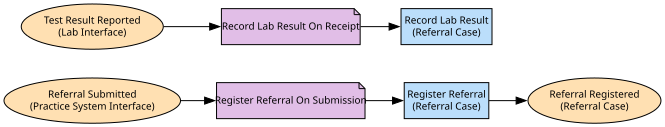

# Triage
Turns a GP referral into a case of our own, decides whether to accept, ask for more information, or decline it, and may hand an accepted case to a consultant.

**Owned by:** Triage Team

## Serves
- [Outpatient Care / Referral Triage](../../domains/outpatient_care/subdomains/referral_triage/index.md) (core)

## Glossary
| Term | Definition | Aliases | Embodied by |
| --- | --- | --- | --- |
| **Referral** | A GP referral, once triage holds it as a case of its own. | Case | Referral |
| **Assessment** | The clinical decision logic a referral is judged against. | - | Triage Assessment |

## Aggregates

### [Referral Case](aggregates/referral_case/index.md)
One referral, from the moment it becomes a case of ours.

	
## Services

### [Triage Assessment](services/triage_assessment/index.md)
The clinical decision logic a referral is judged against. The nurse's own account is that the assessment itself calls out to Records for what is already known about the patient -- not an application service fronting the call -- so that is what is modelled here, even though a domain service is not meant to call outside its own context.

### [Referral Intake](services/referral_intake/index.md)
Takes what the GP's practice system sends and turns it into a case of our own.

### [Lab Ordering](services/lab_ordering/index.md)
Sends a patient for testing at the lab, and folds the result back into our own case once it is translated.

## Invariants
Rules that hold across this context's instances and aggregates; each names the operation that checks it before acting.

| Name | Description | Constrains |
| --- | --- | --- |
| One Active Referral Per Patient | A patient never has more than one active referral open with us at a time. | Referral.patientId, Register Referral |

## Value Objects
> No value objects.

## Schemas
| Name | Description | Attributes | Used by |
| --- | --- | --- | --- |
| Referral Details | A referral, translated out of the GP practice system's own shape into ours. | gpReferralReference: `string` (identifies [GP Practice System](../gp_practice_system/index.md)), requestedSpecialty: `string`, urgency: `string`, clinicalSummary: `string` | Register Referral, Referral Registered |
| Referral Accepted Details | Which case was accepted, and for which patient. | - | Accept Referral, Referral Accepted |
| Information Request Details | What further information triage is asking the GP for. | details: `string` | Request More Information, More Information Requested |
| Consultant Assignment Details | Which consultant an accepted case has been handed to. | consultantId: `string` | Assign Consultant, Case Assigned To Consultant |
| Lab Test Request Details | The test triage wants run, in our own terms. | testCode: `string` | Send Referral For Testing |
| Lab Result Details | A lab result, translated out of the lab's own report shape into ours. | resultCode: `string` | Record Lab Result |
| Patient History Check Request | Which patient the assessment needs to know about. | - | Check Patient History |

## Policies

| Name | Description | On | Then |
| --- | --- | --- | --- |
| Register Referral On Submission | Every submitted referral becomes a case of ours. | Referral Submitted | Register Referral |
| Record Lab Result On Receipt | Every reported result is folded into the case it belongs to. | Test Result Reported | Record Lab Result |

## Processes
> No processes.

## Context Relationships
### Depends on
| With | Description | Type | Upstream Roles | Downstream Roles |
| --- | --- | --- | --- | --- |
| GP Practice System | The practice system's referral message is theirs to change; triage translates it into a case of our own on the way in. | upstream-downstream | published-language | anti-corruption-layer |
| Laboratory | Triage orders tests through the lab's documented interface and translates its own report format into a case's own terms. | upstream-downstream | open-host-service, published-language | anti-corruption-layer |
| Clinical Coding Regulator | Every accepted referral's diagnosis must carry a code from the regulator's published coding standard, taken as it is published. | upstream-downstream | published-language | conformist |
| Patient Records | Triage's assessment looks a patient up through Records' own directory and takes what it gets back as published. | upstream-downstream | open-host-service | conformist |

### Depended on by
| With | Description | Type | Upstream Roles | Downstream Roles |
| --- | --- | --- | --- | --- |
| Scheduling | Scheduling reacts to triage's own accepted-case fact, taking it as published. | upstream-downstream | published-language | conformist |
| Patient Records | Records takes triage's own registered-case fact as published. | upstream-downstream | published-language | conformist |

- `open-host-service` — **Open Host Service** (OHS). A public, stable protocol or API provided by an upstream context.
- `anti-corruption-layer` — **Anti-Corruption Layer** (ACL). A translating boundary isolating a downstream model from external concepts.
- `conformist` — **Conformist** (CF). Downstream adopts the upstream domain model without translation.
- `published-language` — **Published Language** (PL). A well-documented shared interchange format.
- `upstream-downstream` — **Upstream/Downstream** (U/D). One context depends on another; the upstream does not plan around the downstream.

## Consumptions
| Consumer | Made By | Consumed As | Provider | Consumable | Provided As |
| --- | --- | --- | --- | --- | --- |
| [Triage Assessment](services/triage_assessment/index.md) | - | conformist | Patient Directory | Get Patient Summary | open-host-service |
| [Patient Directory](../patient_records/services/patient_directory/index.md) | Register Patient On Referral | conformist | Referral Case | Referral Registered | published-language |
| [Scheduling Desk](../scheduling/services/scheduling_desk/index.md) | Offer Slot On Acceptance | conformist | Referral Case | Referral Accepted | published-language |
| [Referral Intake](services/referral_intake/index.md) | Register Referral On Submission | anti-corruption-layer | Practice System Interface | Referral Submitted | published-language |
| [Lab Ordering](services/lab_ordering/index.md) | - | anti-corruption-layer | Lab Interface | Order Test | open-host-service |
| [Lab Ordering](services/lab_ordering/index.md) | Record Lab Result On Receipt | anti-corruption-layer | Lab Interface | Test Result Reported | published-language |

