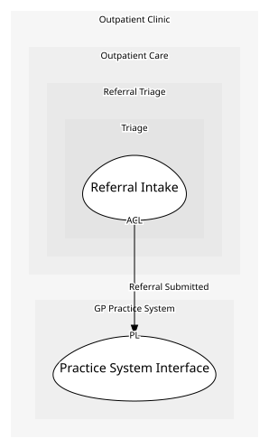

# Referral Intake
Takes what the GP's practice system sends and turns it into a case of our own, and fronts the nurse's decision to accept a case.

## Provides
| Name | Type | Internal | Pattern | Description | Schema | Returns | Rejects with | Raises | Guarded by |
| --- | --- | --- | --- | --- | --- | --- | --- | --- | --- |
| Accept Referral | operation | no | - | Called by the triage nurse once she is satisfied the case should go ahead; fetches the patient's summary from Records before the case moves to accepted. | - | [Referral Accepted Details](../../index.md#schemas) | - | - | Accept Only Known Patient |

- **Accept Referral** also reaches Referral Accepted through the operations it calls, raised where they happen rather than restated here.

## Consumes

### Referral Submitted [anti-corruption-layer]
A referral has been sent by the GP's practice system, in its own message format.
- **Provider**: [Practice System Interface](../../../gp_practice_system/services/practice_system_interface/index.md)
- **Made by**: Register Referral On Submission

### Get Patient Summary [conformist]
Looks a patient up by their internal id.
- **Provider**: [Patient Directory](../../../patient_records/services/patient_directory/index.md)
- **Made by**: Accept Referral

### Accept Referral 
The aggregate's own transition to accepted, run by Referral Intake's front once it has confirmed a patient record already exists for the referral (decision 17).
- **Provider**: [Referral Case](../../aggregates/referral_case/index.md)
- **Made by**: Accept Referral

	
