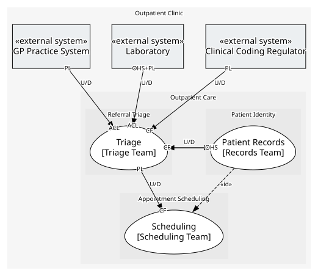

# Outpatient Care
Everything involved in getting a GP-referred patient seen.

## Subdomains

### [Referral Triage](subdomains/referral_triage/index.md) (core)
Deciding what happens to a referral once it arrives: accept it, ask for more information, or decline it.

### [Appointment Scheduling](subdomains/appointment_scheduling/index.md) (supporting)
Turning an accepted case into a booked clinic slot, and keeping the record of clinics, slots, bookings and cancellations.

### [Patient Identity](subdomains/patient_identity/index.md) (supporting)
Knowing who a patient is, and what every other system that refers to them calls them.

## Context Relationships
| Upstream | Relationship | Downstream | Upstream Roles | Downstream Roles |
| --- | --- | --- | --- | --- |
| GP Practice System | upstream-downstream | Triage | published-language | anti-corruption-layer |
| Laboratory | upstream-downstream | Triage | open-host-service, published-language | anti-corruption-layer |
| Clinical Coding Regulator | upstream-downstream | Triage | published-language | conformist |
| Patient Records | upstream-downstream | Triage | open-host-service | conformist |
| Triage | upstream-downstream | Scheduling | published-language | conformist |
| Triage | upstream-downstream | Patient Records | published-language | conformist |
| Patient Records | upstream-downstream (implied by identity) | Scheduling | - | - |

## Consumptions
| Consumer | Consumed As | Provider | Consumable | Provided As |
| --- | --- | --- | --- | --- |
| [Referral Intake](../../boundedcontexts/triage/services/referral_intake/index.md) | anti-corruption-layer | Practice System Interface | Referral Submitted | published-language |
| [Referral Intake](../../boundedcontexts/triage/services/referral_intake/index.md) | conformist | Patient Directory | Get Patient Summary | open-host-service |
| [Patient Directory](../../boundedcontexts/patient_records/services/patient_directory/index.md) | conformist | Referral Case | Referral Registered | published-language |
| [Referral Intake](../../boundedcontexts/triage/services/referral_intake/index.md) | - | Referral Case | Accept Referral | - |
| [Scheduling Desk](../../boundedcontexts/scheduling/services/scheduling_desk/index.md) | conformist | Referral Case | Referral Accepted | published-language |
| [Lab Ordering](../../boundedcontexts/triage/services/lab_ordering/index.md) | anti-corruption-layer | Lab Interface | Order Test | open-host-service |
| [Lab Ordering](../../boundedcontexts/triage/services/lab_ordering/index.md) | anti-corruption-layer | Lab Interface | Test Result Reported | published-language |

	
