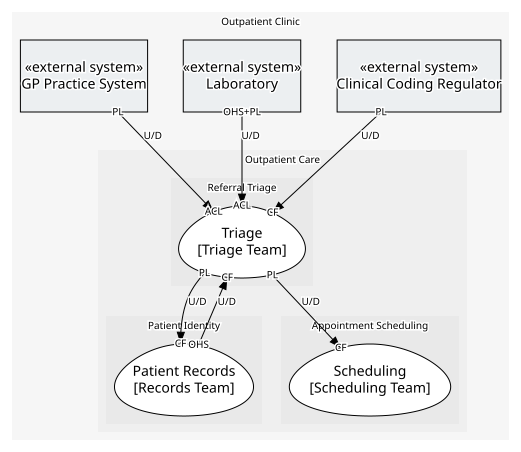

# Referral Triage (core)
Deciding what happens to a referral once it arrives: accept it, ask for more information, or decline it.

## Bounded Contexts

### [Triage](../../../../boundedcontexts/triage/index.md)
Turns a GP referral into a case of our own, decides whether to accept, ask for more information, or decline it, and may hand an accepted case to a consultant.

## Context Relationships
| Upstream | Relationship | Downstream | Upstream Roles | Downstream Roles |
| --- | --- | --- | --- | --- |
| GP Practice System | upstream-downstream | Triage | published-language | anti-corruption-layer |
| Laboratory | upstream-downstream | Triage | open-host-service, published-language | anti-corruption-layer |
| Clinical Coding Regulator | upstream-downstream | Triage | published-language | conformist |
| Patient Records | upstream-downstream | Triage | open-host-service | conformist |
| Triage | upstream-downstream | Scheduling | published-language | conformist |
| Triage | upstream-downstream | Patient Records | published-language | conformist |

## Consumptions
| Consumer | Consumed As | Provider | Consumable | Provided As |
| --- | --- | --- | --- | --- |
| [Triage Assessment](../../../../boundedcontexts/triage/services/triage_assessment/index.md) | conformist | Patient Directory | Get Patient Summary | open-host-service |
| [Patient Directory](../../../../boundedcontexts/patient_records/services/patient_directory/index.md) | conformist | Referral Case | Referral Registered | published-language |
| [Scheduling Desk](../../../../boundedcontexts/scheduling/services/scheduling_desk/index.md) | conformist | Referral Case | Referral Accepted | published-language |
| [Referral Intake](../../../../boundedcontexts/triage/services/referral_intake/index.md) | anti-corruption-layer | Practice System Interface | Referral Submitted | published-language |
| [Lab Ordering](../../../../boundedcontexts/triage/services/lab_ordering/index.md) | anti-corruption-layer | Lab Interface | Order Test | open-host-service |
| [Lab Ordering](../../../../boundedcontexts/triage/services/lab_ordering/index.md) | anti-corruption-layer | Lab Interface | Test Result Reported | published-language |
	
	
