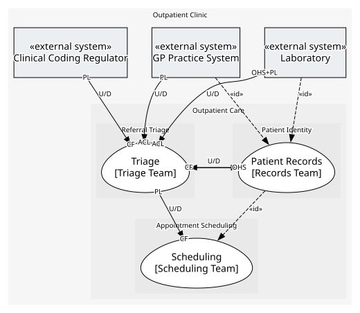

# Outpatient Clinic
Referral, triage, scheduling and diagnostics for patients referred to an outpatient clinic by their GP.

[Glossary](./glossary.md)

## Domains

### [Outpatient Care](../domains/outpatient_care/index.md)
Everything involved in getting a GP-referred patient seen.

## Diagnostics
| Severity | Rule | Message | Element |
| --- | --- | --- | --- |
| error | domain-service-consumes-inside | Domain service "Triage Assessment" consumes "Get Patient Summary" from "Patient Records"; a domain service is the inside of the model, not a client, so let an application service of "Triage" make the call and hand "Triage Assessment" what it needs | `boundedcontexts/triage/services/triage_assessment` |
| warning | rejection-raised | "Offer Slot" rejects with "Patient Waitlisted", which it also raises as the event "Patient Waitlisted"; a rejection says nothing happened and a raised event says something did — if something happened, drop the rejection and keep the event, otherwise it is not an event | `boundedcontexts/scheduling/services/scheduling_desk/provides/offer_slot` |

## Health
### Refactor
> Nothing is marked for refactoring.

### Tolerated
> No compromises recorded.

### No comments
- **GP Practice System → Triage** (upstream-downstream)
- **Laboratory → Triage** (upstream-downstream)
- **Clinical Coding Regulator → Triage** (upstream-downstream)
- **Patient Records → Triage** (upstream-downstream)
- **Triage → Scheduling** (upstream-downstream)
- **Triage → Patient Records** (upstream-downstream)

## Teams
| Team | Owns |
| --- | --- |
| Triage Team | Triage |
| Scheduling Team | Scheduling |
| Records Team | Patient Records |

## Context Relationships
| Upstream | Relationship | Downstream | Upstream Roles | Downstream Roles |
| --- | --- | --- | --- | --- |
| GP Practice System | upstream-downstream | Triage | published-language | anti-corruption-layer |
| Laboratory | upstream-downstream | Triage | open-host-service, published-language | anti-corruption-layer |
| Clinical Coding Regulator | upstream-downstream | Triage | published-language | conformist |
| Patient Records | upstream-downstream | Triage | open-host-service | conformist |
| Triage | upstream-downstream | Scheduling | published-language | conformist |
| Triage | upstream-downstream | Patient Records | published-language | conformist |
| Patient Records | upstream-downstream (implied by identity) | Scheduling | - | - |
| GP Practice System | upstream-downstream (implied by identity) | Patient Records | - | - |
| Laboratory | upstream-downstream (implied by identity) | Patient Records | - | - |

## Consumptions
| Consumer | Consumed As | Provider | Consumable | Provided As |
| --- | --- | --- | --- | --- |
| [Triage Assessment](../boundedcontexts/triage/services/triage_assessment/index.md) | conformist | Patient Directory | Get Patient Summary | open-host-service |
| [Patient Directory](../boundedcontexts/patient_records/services/patient_directory/index.md) | conformist | Referral Case | Referral Registered | published-language |
| [Scheduling Desk](../boundedcontexts/scheduling/services/scheduling_desk/index.md) | conformist | Referral Case | Referral Accepted | published-language |
| [Referral Intake](../boundedcontexts/triage/services/referral_intake/index.md) | anti-corruption-layer | Practice System Interface | Referral Submitted | published-language |
| [Lab Ordering](../boundedcontexts/triage/services/lab_ordering/index.md) | anti-corruption-layer | Lab Interface | Order Test | open-host-service |
| [Lab Ordering](../boundedcontexts/triage/services/lab_ordering/index.md) | anti-corruption-layer | Lab Interface | Test Result Reported | published-language |
	

