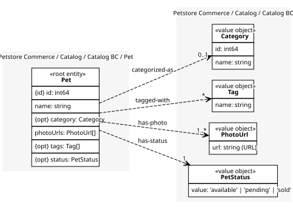
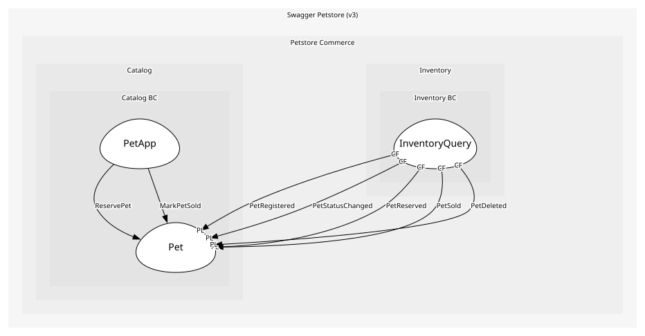

# Pet
A pet listed in the store. One aggregate because a pet's photos, tags and status change together

## Entities and Value Objects
| Type | Name | Description | Attributes |
| --- | --- | --- | --- |
| Entity (Root) | **Pet** | The listed animal; everything else in the aggregate hangs off it | **id**: `int64`, name: `string`, category: `Category` (optional), photoUrls: `PhotoUrl[]`, tags: `Tag[]` (optional), status: `PetStatus` (optional) |
| Value Object | [Category](../../index.md#value-objects) | The kind of animal, e.g. Dogs. A value because two pets in Dogs share one category | id: `int64`, name: `string` |
| Value Object | [PetStatus](../../index.md#value-objects) | Where the pet is in its sales lifecycle. Shared with Inventory, which keys its counts by these values | value: `'available' | 'pending' | 'sold'` |
| Value Object | [PhotoUrl](../../index.md#value-objects) | Where a photo of the pet can be fetched | url: `string (URL)` |
| Value Object | [Tag](../../index.md#value-objects) | Free-form label on a pet | name: `string` |

## Relationships
| Source | Description | Target | Relation | Cardinality |
| --- | --- | --- | --- | --- |
| [Pet - Pet](./index.md#entities-and-value-objects) | categorized-as | Catalog BC - Category | uses | 0..1 |
| [Pet - Pet](./index.md#entities-and-value-objects) | tagged-with | Catalog BC - Tag | uses | * |
| [Pet - Pet](./index.md#entities-and-value-objects) | has-photo | Catalog BC - PhotoUrl | uses | 1..* |
| [Pet - Pet](./index.md#entities-and-value-objects) | has-status | Catalog BC - PetStatus | uses | 0..1 |

## Invariants
| Name | Description | Constrains |
| --- | --- | --- |
| NameRequired | Pet.name must be non-empty, because the storefront lists pets by name | Pet.name |
| SoldNotReopen | Once sold, a pet does not revert to available without an explicit policy, so a buyer is never undercut. Constrains the Pet because the transition is the pet's, not the status value's, and the operation that makes the transition, because that is where the rule is enforced | Pet, ChangePetStatus |

## Provides
| Name | Type | Internal | Pattern | Description | Schema | Returns | Rejects with | Raises | Guarded by |
| --- | --- | --- | --- | --- | --- | --- | --- | --- | --- |
| PetRegistered | event | no | published-language | A new pet was registered | [PetRegistered](../../index.md#schemas) | - | - | - | - |
| PetUpdated | event | no | published-language | Pet profile updated | [PetId](../../index.md#schemas) | - | - | - | - |
| PetStatusChanged | event | no | published-language | The catalogue moved a pet between statuses itself, e.g. relisting a returned pet as available | [PetStatusChanged](../../index.md#schemas) | - | - | - | - |
| PetReserved | event | no | published-language | available → pending: the pet is held for an approved order | [PetId](../../index.md#schemas) | - | - | - | - |
| PetSold | event | no | published-language | pending → sold: the pet has gone to its owner | [PetId](../../index.md#schemas) | - | - | - | - |
| PetDeleted | event | no | published-language | Pet removed from catalog | [PetId](../../index.md#schemas) | - | - | - | - |
| ChangePetStatus | operation | yes | - | Move a pet between available, pending and sold; the catalogue's own edits, e.g. relisting a returned pet | [PetStatusChanged](../../index.md#schemas) | - | - | PetStatusChanged | SoldNotReopen |
| ReservePet | operation | yes | - | available → pending: the pet is held for an approved order; run by PetApp on the request Sales makes | [PetId](../../index.md#schemas) | - | - | PetReserved | - |
| MarkPetSold | operation | yes | - | pending → sold: the pet has gone to its owner; run by PetApp on the request Sales makes | [PetId](../../index.md#schemas) | - | - | PetSold | - |

## Consumes
> No consumptions.
	
