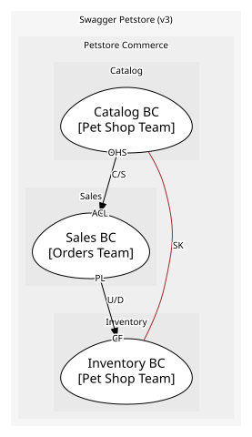

# Catalog BC
Owns the Pet aggregate and the pet-facing operations

**Owned by:** Pet Shop Team

## Serves
- [Petstore Commerce / Catalog](../../domains/petstore_commerce/subdomains/catalog/index.md) (core)

## Glossary
| Term | Definition | Aliases | Embodied by |
| --- | --- | --- | --- |
| **Pet** | An animal listed for sale in the store | - | Pet |
| **Category** | The kind of animal a pet is, such as Dogs or Cats | Species | Category |
| **Available** | A pet that can be ordered; it becomes pending when Sales approves an order for it (ReservePet) and sold when that order is delivered (MarkPetSold) | - | PetStatus |

## Aggregates

### [Pet](aggregates/pet/index.md)
A pet listed in the store. One aggregate because a pet's photos, tags and status change together

	
## Services

### [PetApp](services/pet_app/index.md)
Open-host service for /pet endpoints

## Schemas
| Name | Description | Attributes | Used by |
| --- | --- | --- | --- |
| PetRegistered | What the outside learns when a pet joins the catalog | **petId**: `int64`, name: `string`, category: `Category` | PetRegistered |
| PetStatusChanged | - | **petId**: `int64`, from: `PetStatus`, to: `PetStatus` | PetStatusChanged, ChangePetStatus |
| RegisterPet | Request body for adding a pet | name: `string`, category: `Category` | AddPet |
| PetId | Identifies one pet; shared by every consumable that only needs the id | **petId**: `int64` | PetUpdated, PetDeleted, ReservePet, MarkPetSold, GetPetById, UploadImage, DeletePet, GetPetSummary, ReservePetForOrder, MarkPetSoldForOrder |
| PetSummary | The slim read of a pet other contexts are allowed to hold | **petId**: `int64`, name: `string`, status: `PetStatus` | GetPetSummary |

## Policies
> No policies.

## Context Relationships
### Depended on by
| With | Description | Type | Upstream Roles | Downstream Roles |
| --- | --- | --- | --- | --- |
| Sales BC | Sales needs pet availability; Catalog commits to the summary contract | customer-supplier | open-host-service | anti-corruption-layer |

- **Sales BC** (customer-supplier)
	- Sales reads Catalog through PetSummaryClient, which maps the catalog payload onto the Sales order model. [sales/acl/PetSummaryClient.ts](https://github.com/example/petstore/blob/main/sales/acl/PetSummaryClient.ts)
	- The summary contract is versioned and published; Catalog will not break it without a major release. [catalog/openapi.yaml](https://github.com/example/petstore/blob/main/catalog/openapi.yaml)

### Works alongside
| With | Description | Type | Upstream Roles | Downstream Roles |
| --- | --- | --- | --- | --- |
| Inventory BC | PetStatus and its values are one shared definition | shared-kernel | - | - |

- **Inventory BC** (shared-kernel)
	- PetStatus and its values live in @petstore/kernel and both services compile against it. [packages/kernel/src/PetStatus.ts](https://github.com/example/petstore/blob/main/packages/kernel/src/PetStatus.ts)
	- The kernel has grown past the status enum and now carries pricing rules; it should become a Published Language from Catalog. [ADR-014 Shrink the kernel](https://github.com/example/petstore/blob/main/docs/adr/014-shrink-the-kernel.md)

- `open-host-service` — **Open Host Service** (OHS). A public, stable protocol or API provided by an upstream context.
- `anti-corruption-layer` — **Anti-Corruption Layer** (ACL). A translating boundary isolating a downstream model from external concepts.
- `customer-supplier` — **Customer/Supplier** (C/S). Upstream plans for and prioritizes downstream requirements.
- `shared-kernel` — **Shared Kernel** (SK). A shared subset of domain model and code, co-owned by both teams.

## Consumptions
| Consumer | Consumed As | Provider | Consumable | Provided As |
| --- | --- | --- | --- | --- |
| [OrderApp](../sales_bc/services/order_app/index.md) | anti-corruption-layer | PetApp | GetPetSummary | open-host-service |
| [OrderApp](../sales_bc/services/order_app/index.md) | anti-corruption-layer | PetApp | ReservePetForOrder | open-host-service |
| [OrderApp](../sales_bc/services/order_app/index.md) | anti-corruption-layer | PetApp | MarkPetSoldForOrder | open-host-service |
| [PetApp](services/pet_app/index.md) | - | Pet | ReservePet | - |
| [InventoryProjection](../inventory_bc/aggregates/inventory_projection/index.md) | conformist | Pet | PetRegistered | published-language |
| [InventoryProjection](../inventory_bc/aggregates/inventory_projection/index.md) | conformist | Pet | PetStatusChanged | published-language |
| [InventoryProjection](../inventory_bc/aggregates/inventory_projection/index.md) | conformist | Pet | PetDeleted | published-language |
| [PetApp](services/pet_app/index.md) | - | Pet | MarkPetSold | - |

