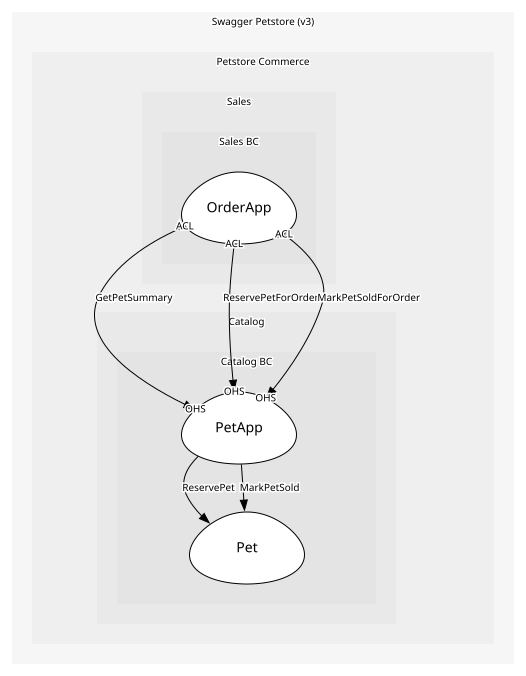

# PetApp
Open-host service for /pet endpoints

## Provides
| Name | Type | Internal | Pattern | Description | Schema | Raises |
| --- | --- | --- | --- | --- | --- | --- |
| AddPet | operation | no | open-host-service | POST /pet | [RegisterPet](../../index.md#schemas) | PetRegistered |
| UpdatePet | operation | no | open-host-service | PUT /pet | - | PetUpdated |
| FindPetsByStatus | operation | no | open-host-service | GET /pet/findByStatus?status=available|pending|sold | - | - |
| GetPetById | operation | no | open-host-service | GET /pet/{petId} | [PetId](../../index.md#schemas) | - |
| UploadImage | operation | no | open-host-service | POST /pet/{petId}/uploadImage; adds a PhotoUrl, so it is a profile update | [PetId](../../index.md#schemas) | PetUpdated |
| DeletePet | operation | no | open-host-service | DELETE /pet/{petId} | [PetId](../../index.md#schemas) | PetDeleted |
| GetPetSummary | operation | no | open-host-service | Slim {id,name,status} read offered to other contexts, so Sales can check availability without coupling to the full Pet | [PetId](../../index.md#schemas) | - |

- **GetPetSummary**
	- The summary projection is the only Catalog read Sales is allowed to make. [GET /pets/{id}/summary](https://github.com/example/petstore/blob/main/catalog/openapi.yaml#/paths/~1pets~1{id}~1summary)

## Consumes
> No consumptions.
	
