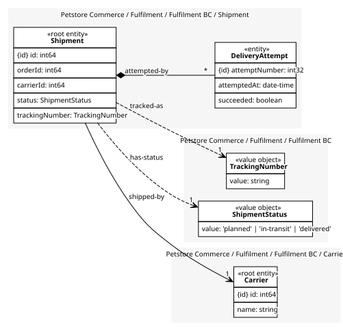

# Carrier
The company that carries a consignment. Its own cluster because carriers are onboarded, rated and retired on their own schedule, nothing to do with any one shipment

## Entities and Value Objects
| Type | Name | Description | Attributes |
| --- | --- | --- | --- |
| Entity (Root) | **Carrier** | One carrier Fulfilment ships with | **id**: `int64`, name: `string` |

## Relationships
| Source | Description | Target | Relation | Cardinality |
| --- | --- | --- | --- | --- |
| [Shipment - Shipment](../shipment/index.md#entities-and-value-objects) | attempted-by | Shipment - DeliveryAttempt | includes | * |
| [Shipment - Shipment](../shipment/index.md#entities-and-value-objects) | tracked-as | Shipment - TrackingNumber | uses | 1 |
| [Shipment - Shipment](../shipment/index.md#entities-and-value-objects) | has-status | Shipment - ShipmentStatus | uses | 1 |
| [Shipment - Shipment](../shipment/index.md#entities-and-value-objects) | shipped-by | Carrier - Carrier | references | 1 |

## Invariants
> No invariants.

## Provides
> No consumables.

## Consumes
> No consumptions.
	
