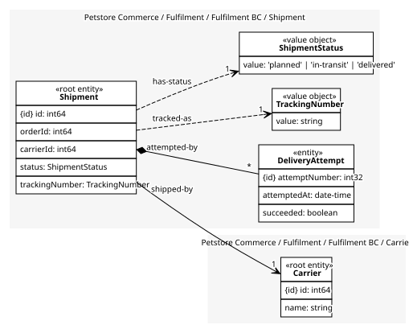
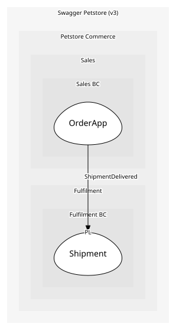

# Shipment
The journey of one approved order to its owner. Attempts live inside it because they mean nothing without the shipment

## Entities and Value Objects
| Type | Name | Description | Attributes |
| --- | --- | --- | --- |
| Entity (Root) | **Shipment** | One consignment for one order | **id**: `int64`, orderId: `int64`, carrierId: `int64`, status: `ShipmentStatus`, trackingNumber: `TrackingNumber` |
| Entity | DeliveryAttempt | A dated try at handing over the pet; an entity because attempts are counted and ordered, a child because it never exists without its shipment | **attemptNumber**: `int32`, attemptedAt: `date-time`, succeeded: `boolean` |
| Value Object | [ShipmentStatus](../../index.md#value-objects) | planned, in-transit or delivered | value: `'planned' | 'in-transit' | 'delivered'` |
| Value Object | [TrackingNumber](../../index.md#value-objects) | Carrier reference; a value because two shipments never share one | value: `string` |

## Relationships
| Source | Description | Target | Relation | Cardinality |
| --- | --- | --- | --- | --- |
| [Shipment - Shipment](./index.md#entities-and-value-objects) | attempted-by | Shipment - DeliveryAttempt | includes | * |
| [Shipment - Shipment](./index.md#entities-and-value-objects) | tracked-as | Fulfilment BC - TrackingNumber | uses | 1 |
| [Shipment - Shipment](./index.md#entities-and-value-objects) | has-status | Fulfilment BC - ShipmentStatus | uses | 1 |
| [Shipment - Shipment](./index.md#entities-and-value-objects) | shipped-by | Carrier - Carrier | references | 1 |

## Invariants
| Name | Description | Constrains |
| --- | --- | --- |
| DeliveredOnlyByAttempt | A shipment becomes delivered only through a successful delivery attempt, so the audit trail is never empty | Shipment |

## Provides
| Name | Type | Internal | Pattern | Description | Schema | Returns | Raises |
| --- | --- | --- | --- | --- | --- | --- | --- |
| ShipmentPlanned | event | yes | - | A ship date was chosen for an approved order | - | - | - |
| ShipmentDelivered | event | no | published-language | The pet reached its owner | [ShipmentDelivered](../../index.md#schemas) | - | - |
| RecordDeliveryAttempt | operation | yes | - | Log a delivery attempt; a successful one delivers the shipment | - | - | ShipmentDelivered |

## Consumes

### OrderApproved [conformist]
Order approved (status=approved); Inventory and Fulfilment both react
- **Provider**: [Order](../../../sales_bc/aggregates/order/index.md)

	
