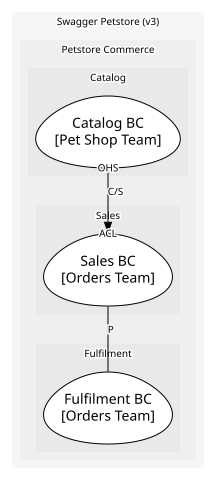
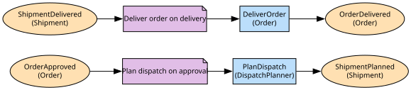

# Fulfilment BC
Plans and tracks the shipment of an approved order until it is delivered

**Owned by:** Orders Team

## Serves
- [Petstore Commerce / Fulfilment](../../domains/petstore_commerce/subdomains/fulfilment/index.md) (supporting)

## Glossary
| Term | Definition | Aliases | Embodied by |
| --- | --- | --- | --- |
| **Shipment** | The consignment that carries one order to its owner | Consignment | Shipment |

## Aggregates

### [Shipment](aggregates/shipment/index.md)
The journey of one approved order to its owner. Attempts live inside it because they mean nothing without the shipment

### [Carrier](aggregates/carrier/index.md)
The company that carries a consignment. Its own cluster because carriers are onboarded, rated and retired on their own schedule, nothing to do with any one shipment

	
## Services

### [DispatchPlanner](services/dispatch_planner/index.md)
Chooses ship dates across planned shipments so orders approved on the same day leave together; it only needs orderIds and dates, which is all OrderApproved gives it

### [ShipmentApp](services/shipment_app/index.md)
Fulfilment's application service: the boundary through which Fulfilment reports delivery to Sales

## Invariants
> No invariants across aggregates.

## Value Objects
| Name | Description | Attributes | Invariants | Used by |
| --- | --- | --- | --- | --- |
| TrackingNumber | Carrier reference; a value because two shipments never share one | value: `string` | - | Shipment |
| ShipmentStatus | planned, in-transit or delivered | value: `'planned' | 'in-transit' | 'delivered'` | - | Shipment |

## Schemas
| Name | Description | Attributes | Used by |
| --- | --- | --- | --- |
| ShipmentDelivered | - | **shipmentId**: `int64`, orderId: `int64` (identifies [Order](../sales_bc/aggregates/order/index.md)), deliveredAt: `date-time` | ShipmentDelivered, ReportDelivery |

## Policies

| Name | Description | On | Then |
| --- | --- | --- | --- |
| Plan dispatch on approval | Every approved order gets a shipment planned straight away | OrderApproved | PlanDispatch |
| Deliver order on delivery | When a shipment is delivered, report it to Sales so the order moves to delivered | ShipmentDelivered | ReportDelivery |

## Processes
> No processes.

## Context Relationships
### Works alongside
| With | Description | Type | Upstream Roles | Downstream Roles |
| --- | --- | --- | --- | --- |
| Sales BC | Order lifecycle and shipment lifecycle are designed and released together | partnership | - | - |

- **Sales BC** (partnership)
	- Both services ship from one release train; the pipeline deploys sales and fulfilment as a pair and fails the build if only one is tagged.
	- OrderApproved crosses into Fulfilment and Fulfilment calls ConfirmDelivery back, both with no translation layer. Neither side treats the other as a supplier to be protected from, which is what makes this a partnership rather than customer-supplier; the traffic happening to run one way says nothing about that.

- `partnership` — **Partnership** (P). Mutual co-operation where teams coordinate development and releases.

## Consumptions
| Consumer | Made By | Consumed As | Provider | Consumable | Provided As |
| --- | --- | --- | --- | --- | --- |
| [ShipmentApp](services/shipment_app/index.md) | ReportDelivery | - | OrderApp | ConfirmDelivery | open-host-service |
| [OrderApp](../sales_bc/services/order_app/index.md) | ConfirmDelivery | - | Order | DeliverOrder | - |
| [OrderApp](../sales_bc/services/order_app/index.md) | ReservePet | anti-corruption-layer | PetApp | ReservePetForOrder | open-host-service |
| [PetApp](../catalog_bc/services/pet_app/index.md) | ReservePetForOrder | - | Pet | ReservePet | - |
| [PetApp](../catalog_bc/services/pet_app/index.md) | MarkPetSoldForOrder | - | Pet | MarkPetSold | - |
| [OrderApp](../sales_bc/services/order_app/index.md) | MarkPetSold | anti-corruption-layer | PetApp | MarkPetSoldForOrder | open-host-service |
| [OrderApp](../sales_bc/services/order_app/index.md) | Order fulfilment | anti-corruption-layer | PetApp | GetPetSummary | open-host-service |
| [OrderApp](../sales_bc/services/order_app/index.md) | Order fulfilment | anti-corruption-layer | Pet | PetStatusChanged | published-language |
| [ShipmentApp](services/shipment_app/index.md) | Plan dispatch on approval | conformist | Order | OrderApproved | published-language |

