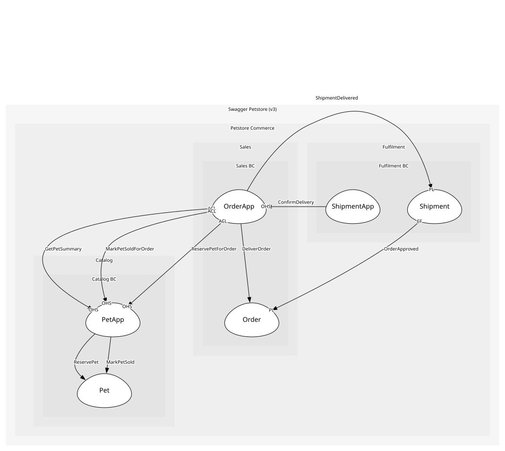

# ShipmentApp
Fulfilment's application service: the boundary through which Fulfilment reports delivery to Sales

## Provides
| Name | Type | Internal | Pattern | Description | Schema | Returns | Raises |
| --- | --- | --- | --- | --- | --- | --- | --- |
| ReportDelivery | operation | yes | - | Tell Sales the shipment arrived, by calling the order's ConfirmDelivery | [ShipmentDelivered](../../index.md#schemas) | - | - |

## Consumes

### ConfirmDelivery 
POST /store/order/{orderId}/delivered; Fulfilment reports the shipment arrived and the order moves to delivered
- **Provider**: [OrderApp](../../../sales_bc/services/order_app/index.md)

	
