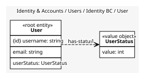

# User
Petstore user record, as the legacy API shapes it

## Entities and Value Objects
| Type | Name | Description | Attributes |
| --- | --- | --- | --- |
| Entity (Root) | **User** | A registered user of the store | **username**: `string`, email: `string`, userStatus: `UserStatus` |
| Value Object | UserStatus | Untyped int per the Petstore v3 model; nobody remembers the meaning of each value | value: `int` |

## Relationships
| Source | Description | Target | Relation | Cardinality |
| --- | --- | --- | --- | --- |
| [User - User](./index.md#entities-and-value-objects) | has-status | User - UserStatus | uses | 1 |

## Invariants
> No invariants.

## Provides
| Name | Type | Internal | Pattern | Description | Schema | Returns | Raises |
| --- | --- | --- | --- | --- | --- | --- | --- |
| UserRegistered | event | no | published-language | New user created | - | - | - |
| UserLoggedIn | event | no | published-language | Login via /user/login | - | - | - |
| UserLoggedOut | event | no | published-language | Logout via /user/logout | - | - | - |

## Consumes
> No consumptions.
	
