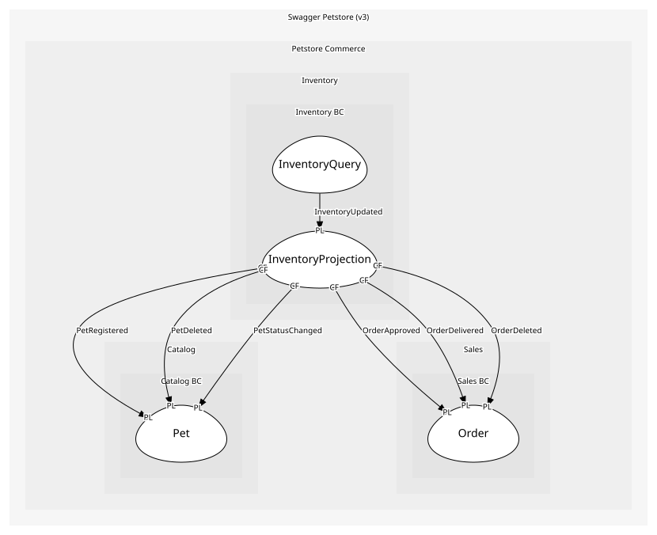

# InventoryProjection
Materialized view: { available: number, pending: number, sold: number }. An aggregate because the counts are rebuilt as one unit

## Entities and Value Objects
| Type | Name | Description | Attributes |
| --- | --- | --- | --- |
| Entity (Root) | **InventoryView** | Status→count map for /store/inventory | - |

## Relationships

## Invariants
> No invariants.

## Provides
| Name | Type | Internal | Pattern | Description | Schema | Returns | Raises |
| --- | --- | --- | --- | --- | --- | --- | --- |
| InventoryUpdated | event | no | published-language | Inventory counts changed | - | - | - |
| RecountInventory | operation | yes | - | Recompute the status→count map from catalog and sales facts | - | - | InventoryUpdated |

## Consumes

### PetRegistered [conformist]
A new pet was registered
- **Provider**: [Pet](../../../catalog_bc/aggregates/pet/index.md)

### PetDeleted [conformist]
Pet removed from catalog
- **Provider**: [Pet](../../../catalog_bc/aggregates/pet/index.md)

### PetStatusChanged [conformist]
Pet status changed (available|pending|sold)
- **Provider**: [Pet](../../../catalog_bc/aggregates/pet/index.md)

### OrderApproved [conformist]
Order approved (status=approved); Inventory and Fulfilment both react
- **Provider**: [Order](../../../sales_bc/aggregates/order/index.md)

### OrderDelivered [conformist]
Order delivered (status=delivered)
- **Provider**: [Order](../../../sales_bc/aggregates/order/index.md)

### OrderDeleted [conformist]
Order deleted via DELETE /store/order/{orderId}
- **Provider**: [Order](../../../sales_bc/aggregates/order/index.md)

	
