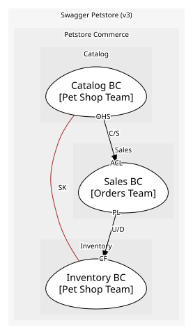
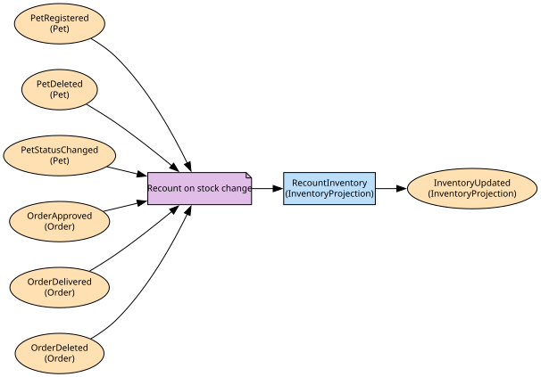

# Inventory BC
Projection for /store/inventory (status→count)

**Owned by:** Pet Shop Team

## Serves
- [Petstore Commerce / Inventory](../../domains/petstore_commerce/subdomains/inventory/index.md) (supporting)
- [Petstore Commerce / Catalog](../../domains/petstore_commerce/subdomains/catalog/index.md) (core)

## Glossary
| Term | Definition | Aliases | Embodied by |
| --- | --- | --- | --- |
| **Availability** | How many pets are available, pending and sold right now; a projection, not a source of truth | Stock | InventoryProjection |

## Aggregates

### [InventoryProjection](aggregates/inventory_projection/index.md)
Materialized view: { available: number, pending: number, sold: number }. An aggregate because the counts are rebuilt as one unit

	
## Services

### [InventoryQuery](services/inventory_query/index.md)
Open-host service for /store/inventory

## Value Objects
> No value objects.

## Schemas
| Name | Description | Attributes | Used by |
| --- | --- | --- | --- |
| InventoryCounts | How many pets stand in each status right now | available: `int32`, pending: `int32`, sold: `int32` | GetInventory |

## Policies

| Name | Description | On | Then |
| --- | --- | --- | --- |
| Recount on stock change | Keep the availability projection current | PetRegistered, PetDeleted, PetStatusChanged, OrderApproved, OrderDelivered, OrderDeleted | RecountInventory |

## Context Relationships
### Depends on
| With | Description | Type | Upstream Roles | Downstream Roles |
| --- | --- | --- | --- | --- |
| Sales BC | The projection counts orders as Sales reports them | upstream-downstream | published-language | conformist |

- **Sales BC** (upstream-downstream)
	- The projection conforms to the Sales order events rather than translating them; accepted while Inventory stays read-only. [inventory/projection/OrderEventHandler.ts](https://github.com/example/petstore/blob/main/inventory/projection/OrderEventHandler.ts)

### Works alongside
| With | Description | Type | Upstream Roles | Downstream Roles |
| --- | --- | --- | --- | --- |
| Catalog BC | PetStatus and its values are one shared definition | shared-kernel | - | - |

- **Catalog BC** (shared-kernel)
	- PetStatus and its values live in @petstore/kernel and both services compile against it. [packages/kernel/src/PetStatus.ts](https://github.com/example/petstore/blob/main/packages/kernel/src/PetStatus.ts)
	- The kernel has grown past the status enum and now carries pricing rules; it should become a Published Language from Catalog. [ADR-014 Shrink the kernel](https://github.com/example/petstore/blob/main/docs/adr/014-shrink-the-kernel.md)

- `conformist` — **Conformist** (CF). Downstream adopts the upstream domain model without translation.
- `published-language` — **Published Language** (PL). A well-documented shared interchange format.
- `upstream-downstream` — **Upstream/Downstream** (U/D). One context depends on another; the upstream does not plan around the downstream.
- `shared-kernel` — **Shared Kernel** (SK). A shared subset of domain model and code, co-owned by both teams.

## Consumptions
| Consumer | Consumed As | Provider | Consumable | Provided As |
| --- | --- | --- | --- | --- |
| [InventoryQuery](services/inventory_query/index.md) | - | InventoryProjection | InventoryUpdated | published-language |
| [InventoryProjection](aggregates/inventory_projection/index.md) | conformist | Pet | PetRegistered | published-language |
| [InventoryProjection](aggregates/inventory_projection/index.md) | conformist | Pet | PetDeleted | published-language |
| [InventoryProjection](aggregates/inventory_projection/index.md) | conformist | Pet | PetStatusChanged | published-language |
| [InventoryProjection](aggregates/inventory_projection/index.md) | conformist | Order | OrderApproved | published-language |
| [InventoryProjection](aggregates/inventory_projection/index.md) | conformist | Order | OrderDelivered | published-language |
| [InventoryProjection](aggregates/inventory_projection/index.md) | conformist | Order | OrderDeleted | published-language |

