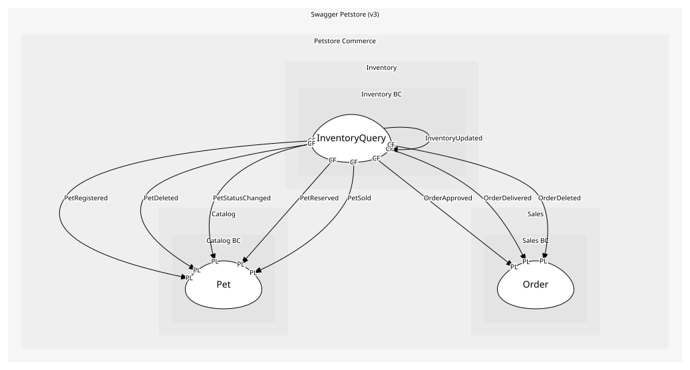

# InventoryQuery
Open-host service for /store/inventory

## Provides
| Name | Type | Internal | Pattern | Description | Schema | Returns | Raises | Guarded by |
| --- | --- | --- | --- | --- | --- | --- | --- | --- |
| GetInventory | operation | no | open-host-service | GET /store/inventory; takes nothing, answers with the counts | - | [InventoryCounts](../../index.md#schemas) | - | - |

## Consumes

### InventoryUpdated 
Inventory counts changed
- **Provider**: [InventoryProjection](../../aggregates/inventory_projection/index.md)

	
