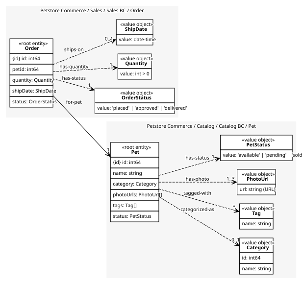
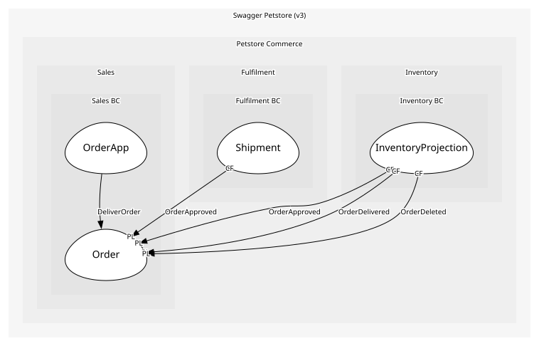

# Order
Order for a single pet

## Entities and Value Objects
| Type | Name | Description | Attributes |
| --- | --- | --- | --- |
| Entity (Root) | **Order** | The customer's request to buy one pet | **id**: `int64`, petId: `int64` (identifies [Pet](../../../catalog_bc/aggregates/pet/index.md)), quantity: `Quantity`, shipDate: `ShipDate` (optional), status: `OrderStatus` |
| Value Object | [OrderStatus](../../index.md#value-objects) | Where the order is in its lifecycle | value: `'placed' | 'approved' | 'delivered'` |
| Value Object | [Quantity](../../index.md#value-objects) | The v3 API's quantity field, kept for the wire shape. A Pet is an individual animal, so the invariant below pins it to 1 | value: `int > 0` |
| Value Object | [ShipDate](../../index.md#value-objects) | When the order ships; set by Fulfilment once dispatch is planned | value: `date-time` |

## Relationships
| Source | Description | Target | Relation | Cardinality |
| --- | --- | --- | --- | --- |
| [Order - Order](./index.md#entities-and-value-objects) | has-status | Sales BC - OrderStatus | uses | 1 |
| [Order - Order](./index.md#entities-and-value-objects) | has-quantity | Sales BC - Quantity | uses | 1 |
| [Order - Order](./index.md#entities-and-value-objects) | ships-on | Sales BC - ShipDate | uses | 0..1 |

## Invariants
| Name | Description | Constrains |
| --- | --- | --- |
| OneAnimalPerOrder | Quantity is exactly 1: a Pet is one animal with one status, so it cannot be sold five times. The API's quantity field is accepted but never exceeds one | Quantity |
| ApproveOnlyWhenAvailable | Move to approved only after the catalogue's summary reported the pet available; the catalogue's status itself is outside this aggregate, so the check is a read through the ACL, not a shared invariant | OrderStatus |
| DeliverOnlyWhenApproved | Deliver only from approved and only once a ship date is set, so nothing is marked delivered that was never checked or never dispatched | OrderStatus, ShipDate |

## Provides
| Name | Type | Internal | Pattern | Description | Schema | Returns | Rejects with | Raises | Guarded by |
| --- | --- | --- | --- | --- | --- | --- | --- | --- | --- |
| OrderPlaced | event | no | published-language | Order created (status=placed) | [OrderPlaced](../../index.md#schemas) | - | - | - | - |
| OrderApproved | event | no | published-language | Order approved (status=approved); Inventory and Fulfilment both react | [OrderId](../../index.md#schemas) | - | - | - | - |
| OrderDelivered | event | no | published-language | Order delivered (status=delivered) | [OrderId](../../index.md#schemas) | - | - | - | - |
| OrderDeleted | event | no | published-language | Order deleted via DELETE /store/order/{orderId} | [OrderId](../../index.md#schemas) | - | - | - | - |
| ApproveOrder | operation | yes | - | Approve a placed order once the pet is available | [OrderId](../../index.md#schemas) | - | - | OrderApproved | - |
| DeliverOrder | operation | yes | - | Mark an approved order as delivered; run by OrderApp when Fulfilment reports the shipment arrived | [OrderId](../../index.md#schemas) | - | - | OrderDelivered | - |

## Consumes
> No consumptions.
	
