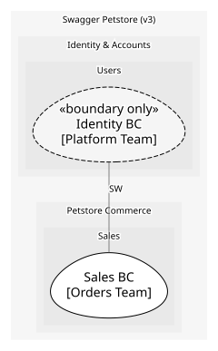

# Identity & Accounts
Users and sessions per Petstore API; kept as its own domain because it would be bought rather than built

## Subdomains

### [Users](subdomains/users/index.md) (generic)
User records and login/logout. Generic: an off-the-shelf identity provider would serve

## Context Relationships
| Upstream | Relationship | Downstream | Upstream Roles | Downstream Roles |
| --- | --- | --- | --- | --- |
| Identity BC | separate-ways | Sales BC | - | - |

## Consumptions

	
