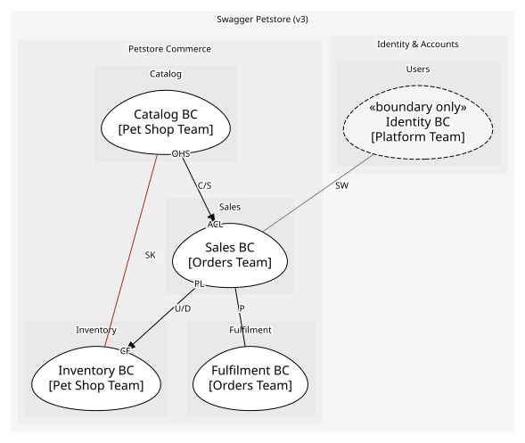

# Petstore Commerce
Core pet catalog, sales, and inventory capabilities: everything that turns a listed pet into a delivered one

## Subdomains

### [Catalog](subdomains/catalog/index.md) (core)
Pet definitions, attributes, lifecycle. Core because the selection of pets is what customers come for

### [Sales](subdomains/sales/index.md) (core)
Orders and order lifecycle. Core because approving the right order at the right time is the store's promise

### [Inventory](subdomains/inventory/index.md) (supporting)
Aggregated availability by status. Supporting: it must exist, but any correct count will do

### [Fulfilment](subdomains/fulfilment/index.md) (supporting)
Getting a sold pet to its owner. Supporting: needed, but a courier could do it just as well

## Context Relationships
| Upstream | Relationship | Downstream | Upstream Roles | Downstream Roles |
| --- | --- | --- | --- | --- |
| Catalog BC | customer-supplier | Sales BC | open-host-service | anti-corruption-layer |
| Sales BC | upstream-downstream | Inventory BC | published-language | conformist |
| Catalog BC | shared-kernel | Inventory BC | - | - |
| Sales BC | partnership | Fulfilment BC | - | - |
| Identity BC | separate-ways | Sales BC | - | - |

## Consumptions
| Consumer | Consumed As | Provider | Consumable | Provided As |
| --- | --- | --- | --- | --- |
| [OrderApp](../../boundedcontexts/sales_bc/services/order_app/index.md) | anti-corruption-layer | PetApp | GetPetSummary | open-host-service |
| [OrderApp](../../boundedcontexts/sales_bc/services/order_app/index.md) | anti-corruption-layer | PetApp | ReservePetForOrder | open-host-service |
| [OrderApp](../../boundedcontexts/sales_bc/services/order_app/index.md) | anti-corruption-layer | PetApp | MarkPetSoldForOrder | open-host-service |
| [PetApp](../../boundedcontexts/catalog_bc/services/pet_app/index.md) | - | Pet | ReservePet | - |
| [InventoryProjection](../../boundedcontexts/inventory_bc/aggregates/inventory_projection/index.md) | conformist | Pet | PetRegistered | published-language |
| [InventoryProjection](../../boundedcontexts/inventory_bc/aggregates/inventory_projection/index.md) | conformist | Pet | PetStatusChanged | published-language |
| [InventoryProjection](../../boundedcontexts/inventory_bc/aggregates/inventory_projection/index.md) | conformist | Pet | PetDeleted | published-language |
| [PetApp](../../boundedcontexts/catalog_bc/services/pet_app/index.md) | - | Pet | MarkPetSold | - |
| [InventoryQuery](../../boundedcontexts/inventory_bc/services/inventory_query/index.md) | - | InventoryProjection | InventoryUpdated | published-language |
| [InventoryProjection](../../boundedcontexts/inventory_bc/aggregates/inventory_projection/index.md) | conformist | Order | OrderApproved | published-language |
| [Shipment](../../boundedcontexts/fulfilment_bc/aggregates/shipment/index.md) | conformist | Order | OrderApproved | published-language |
| [InventoryProjection](../../boundedcontexts/inventory_bc/aggregates/inventory_projection/index.md) | conformist | Order | OrderDelivered | published-language |
| [InventoryProjection](../../boundedcontexts/inventory_bc/aggregates/inventory_projection/index.md) | conformist | Order | OrderDeleted | published-language |
| [OrderApp](../../boundedcontexts/sales_bc/services/order_app/index.md) | - | Order | DeliverOrder | - |
| [ShipmentApp](../../boundedcontexts/fulfilment_bc/services/shipment_app/index.md) | - | OrderApp | ConfirmDelivery | open-host-service |
| [OrderApp](../../boundedcontexts/sales_bc/services/order_app/index.md) | - | Shipment | ShipmentDelivered | published-language |

	
