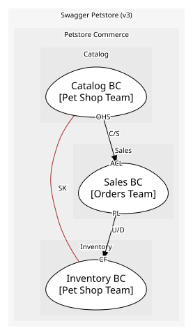

# Catalog (core)
Pet definitions, attributes, lifecycle. Core because the selection of pets is what customers come for

## Bounded Contexts

### [Catalog BC](../../../../boundedcontexts/catalog_bc/index.md)
Owns the Pet aggregate and the pet-facing operations

### [Inventory BC](../../../../boundedcontexts/inventory_bc/index.md)
Projection for /store/inventory (status→count)

## Context Relationships
| Upstream | Relationship | Downstream | Upstream Roles | Downstream Roles |
| --- | --- | --- | --- | --- |
| Catalog BC | customer-supplier | Sales BC | open-host-service | anti-corruption-layer |
| Sales BC | upstream-downstream | Inventory BC | published-language | conformist |
| Catalog BC | shared-kernel | Inventory BC | - | - |

## Consumptions
| Consumer | Consumed As | Provider | Consumable | Provided As |
| --- | --- | --- | --- | --- |
| [OrderApp](../../../../boundedcontexts/sales_bc/services/order_app/index.md) | anti-corruption-layer | PetApp | GetPetSummary | open-host-service |
| [OrderApp](../../../../boundedcontexts/sales_bc/services/order_app/index.md) | anti-corruption-layer | PetApp | ReservePetForOrder | open-host-service |
| [OrderApp](../../../../boundedcontexts/sales_bc/services/order_app/index.md) | anti-corruption-layer | PetApp | MarkPetSoldForOrder | open-host-service |
| [PetApp](../../../../boundedcontexts/catalog_bc/services/pet_app/index.md) | - | Pet | ReservePet | - |
| [InventoryQuery](../../../../boundedcontexts/inventory_bc/services/inventory_query/index.md) | conformist | Pet | PetRegistered | published-language |
| [InventoryQuery](../../../../boundedcontexts/inventory_bc/services/inventory_query/index.md) | conformist | Pet | PetStatusChanged | published-language |
| [InventoryQuery](../../../../boundedcontexts/inventory_bc/services/inventory_query/index.md) | conformist | Pet | PetReserved | published-language |
| [InventoryQuery](../../../../boundedcontexts/inventory_bc/services/inventory_query/index.md) | conformist | Pet | PetSold | published-language |
| [InventoryQuery](../../../../boundedcontexts/inventory_bc/services/inventory_query/index.md) | conformist | Pet | PetDeleted | published-language |
| [PetApp](../../../../boundedcontexts/catalog_bc/services/pet_app/index.md) | - | Pet | MarkPetSold | - |
| [InventoryQuery](../../../../boundedcontexts/inventory_bc/services/inventory_query/index.md) | - | InventoryQuery | InventoryUpdated | published-language |
| [InventoryQuery](../../../../boundedcontexts/inventory_bc/services/inventory_query/index.md) | conformist | Order | OrderApproved | published-language |
| [InventoryQuery](../../../../boundedcontexts/inventory_bc/services/inventory_query/index.md) | conformist | Order | OrderDelivered | published-language |
| [InventoryQuery](../../../../boundedcontexts/inventory_bc/services/inventory_query/index.md) | conformist | Order | OrderDeleted | published-language |
	
	
