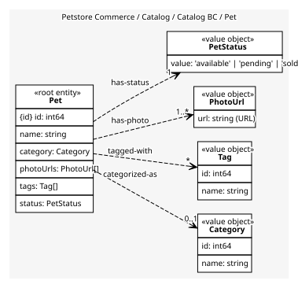
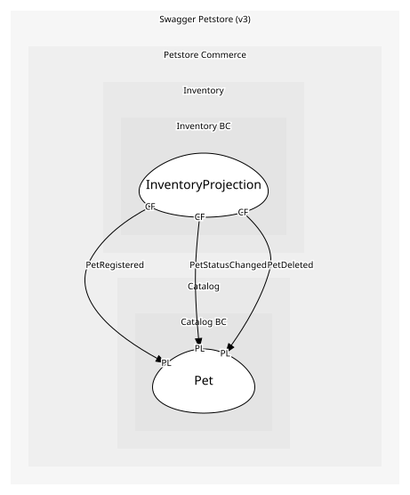

# Pet
A pet listed in the store

## Entities and Value Objects
| Type | Name | Description | Attributes |
| --- | --- | --- | --- |
| Entity (Root) | **Pet** | Pet root entity | **id**: `int64`, name: `string`, category: `Category`, photoUrls: `PhotoUrl[]`, tags: `Tag[]`, status: `PetStatus` |
| Value Object | Category | The kind of animal, e.g. Dogs | id: `int64`, name: `string` |
| Value Object | Tag | Free-form label on a pet | id: `int64`, name: `string` |
| Value Object | PhotoUrl | Where a photo of the pet can be fetched | url: `string (URL)` |
| Value Object | PetStatus | Where the pet is in its sales lifecycle | value: `'available' | 'pending' | 'sold'` |

## Relationships
| Source | Description | Target | Relation | Cardinality |
| --- | --- | --- | --- | --- |
| [Pet](entities/pet/index.md) | categorized-as | Pet - Category | uses | 0..1 |
| [Pet](entities/pet/index.md) | tagged-with | Pet - Tag | uses | * |
| [Pet](entities/pet/index.md) | has-photo | Pet - PhotoUrl | uses | 1..* |
| [Pet](entities/pet/index.md) | has-status | Pet - PetStatus | uses | 1 |

## Invariants
| Name | Description | Constrains |
| --- | --- | --- |
| NameRequired | Pet.name must be non-empty | Pet.name |
| SoldNotReopen | Once sold, do not revert to available without explicit policy | PetStatus |

## Provides
| Name | Type | Internal | Pattern | Description | Schema | Raises |
| --- | --- | --- | --- | --- | --- | --- |
| PetRegistered | event | no | published-language | A new pet was registered | [PetRegistered](../../index.md#schemas) | - |
| PetUpdated | event | no | published-language | Pet profile updated | - | - |
| PetStatusChanged | event | no | published-language | Pet status changed (available|pending|sold) | [PetStatusChanged](../../index.md#schemas) | - |
| PetPhotoUploaded | event | no | published-language | Photo added via upload | - | - |
| PetDeleted | event | no | published-language | Pet removed from catalog | - | - |
| ChangePetStatus | operation | yes | - | Move a pet between available, pending and sold | [PetStatusChanged](../../index.md#schemas) | PetStatusChanged |

## Consumes
> No consumptions.
	
