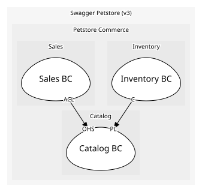

# Catalog BC
Owns Pet aggregate & pet-facing operations

## Serves
- [Petstore Commerce / Catalog](../../domains/petstore_commerce/subdomains/catalog/index.md) (core)

## Aggregates

### [Pet](aggregates/pet/index.md)
A pet listed in the store

	
## Services

### [PetApp](services/pet_app/index.md)
Open-host service for /pet endpoints

## Relationships
| Consumer | Consumed As | Provider | Consumable | Provided As |
| --- | --- | --- | --- | --- |
| [OrderApp](../sales_bc/services/order_app/index.md) | anti-corruption-layer | PetApp | GetPetSummary | open-host-service |
| [InventoryProjection](../inventory_bc/aggregates/inventory_projection/index.md) | conformist | Pet | PetRegistered | published-language |
| [InventoryProjection](../inventory_bc/aggregates/inventory_projection/index.md) | conformist | Pet | PetStatusChanged | published-language |
| [InventoryProjection](../inventory_bc/aggregates/inventory_projection/index.md) | conformist | Pet | PetDeleted | published-language |

