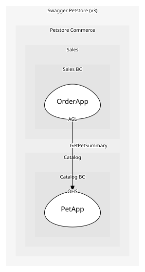

# PetApp
Open-host service for /pet endpoints

## Provides
| Name | Type | Internal | Pattern | Description | Schema | Raises |
| --- | --- | --- | --- | --- | --- | --- |
| AddPet | operation | no | open-host-service | POST /pet | [RegisterPet](../../index.md#schemas) | PetRegistered |
| UpdatePet | operation | no | open-host-service | PUT /pet | - | PetUpdated |
| FindPetsByStatus | operation | no | open-host-service | GET /pet/findByStatus?status=available|pending|sold | - | - |
| FindPetsByTags | operation | no | open-host-service | GET /pet/findByTags?tags=tag1,tag2 | - | - |
| GetPetById | operation | no | open-host-service | GET /pet/{petId} | - | - |
| UploadPetImage | operation | no | open-host-service | POST /pet/{petId}/uploadImage (multipart: additionalMetadata, file) | - | PetPhotoUploaded |
| DeletePet | operation | no | open-host-service | DELETE /pet/{petId} | [PetId](../../index.md#schemas) | PetDeleted |
| GetPetSummary | operation | no | open-host-service | Slim {id,name,status} read offered to other contexts for ACL checks | - | - |

## Consumes
> No consumptions.
	
