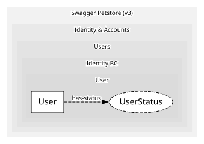

# User
Petstore user record

## Entities and Value Objects
| Type | Name | Description | Attributes |
| --- | --- | --- | --- |
| Entity (Root) | **User** | A registered user of the store | **username**: `string`, firstName: `string`, lastName: `string`, email: `string`, phone: `string`, userStatus: `UserStatus` |
| Value Object | UserStatus | Untyped int per the Petstore v3 model | value: `int` |

## Relationships
| Source | Description | Target | Relation | Cardinality |
| --- | --- | --- | --- | --- |
| [User](entities/user/index.md) | has-status | User - UserStatus | uses | - |

## Commands
> No commands.

## Events
| Name | Description | Attributes |
| --- | --- | --- |
| UserRegistered | New user created | - |
| UserUpdated | User fields updated | - |
| UserDeleted | User removed | - |
| UserLoggedIn | Login via /user/login | - |
| UserLoggedOut | Logout via /user/logout | - |

## Invariants
> No invariants.

## Provides

### (event) - UserRegistered [published-language]
undefined

### (event) - UserUpdated [published-language]
undefined

### (event) - UserDeleted [published-language]
undefined

### (event) - UserLoggedIn [published-language]
undefined

### (event) - UserLoggedOut [published-language]
undefined

## Consumes
> No consumptions.
	
