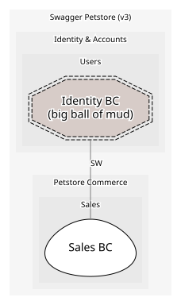

# Identity BC
> ⚠️ **Big ball of mud.** This context's model is not coherent; neighbours should protect themselves with an anti-corruption layer.

Owns User aggregate & user endpoints. Legacy: user status is an untyped int and login is a GET

**Owned by:** [Platform Team](https://petstore.swagger.io/#/user)

## Serves
- [Identity & Accounts / Users](../../domains/identity_&_accounts/subdomains/users/index.md) (generic)

## Aggregates

### [User](aggregates/user/index.md)
Petstore user record

	
## Services

### [UserApp](services/user_app/index.md)
Open-host service for /user endpoints

## Context Relationships
| Upstream | Relationship | Downstream | Upstream Roles | Downstream Roles |
| --- | --- | --- | --- | --- |
| Identity BC | separate-ways | Sales BC | - | - |

## Consumptions

