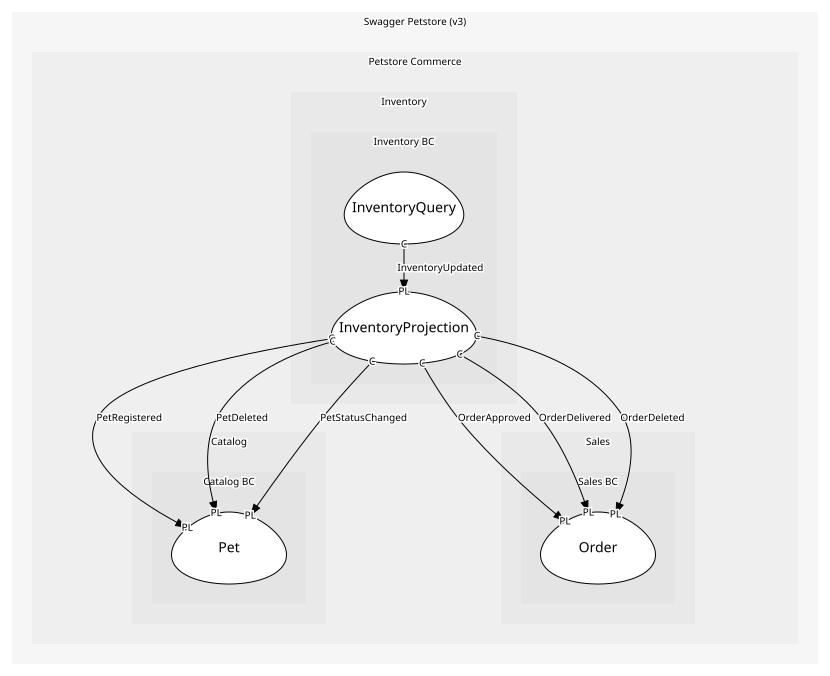

# InventoryProjection
Materialized view: { available: number, pending: number, sold: number }

## Entities and Value Objects
| Type | Name | Description | Attributes |
| --- | --- | --- | --- |
| Entity (Root) | **InventoryView** | Status→count map for /store/inventory | - |

## Relationships

## Commands
| Name | Description | Attributes | Raises |
| --- | --- | --- | --- |
| RecountInventory | Recompute the status→count map from catalog and sales facts | - | InventoryUpdated |

## Events
| Name | Description | Attributes |
| --- | --- | --- |
| InventoryUpdated | Inventory counts changed | - |

## Invariants
> No invariants.

## Provides

### (event) - InventoryUpdated [published-language]
undefined

## Consumes

### PetRegistered [conformist]
undefined
- **Provider**: [Pet](../../../catalog_bc/aggregates/pet/index.md)

### PetDeleted [conformist]
undefined
- **Provider**: [Pet](../../../catalog_bc/aggregates/pet/index.md)

### PetStatusChanged [conformist]
undefined
- **Provider**: [Pet](../../../catalog_bc/aggregates/pet/index.md)

### OrderApproved [conformist]
undefined
- **Provider**: [Order](../../../sales_bc/aggregates/order/index.md)

### OrderDelivered [conformist]
undefined
- **Provider**: [Order](../../../sales_bc/aggregates/order/index.md)

### OrderDeleted [conformist]
undefined
- **Provider**: [Order](../../../sales_bc/aggregates/order/index.md)

	
