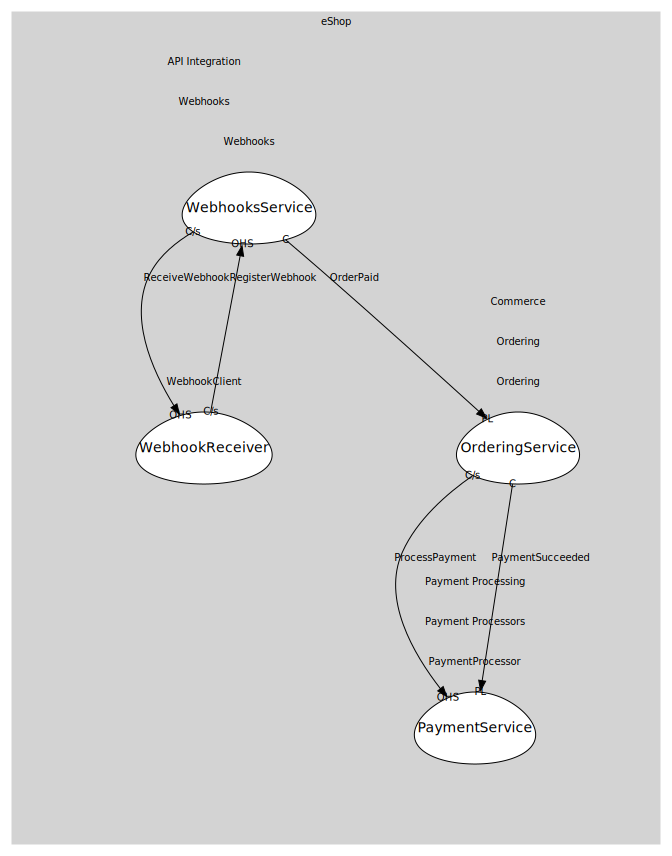

# WebhooksService
Webhook registration/delivery application service.

## Provides

### (operation) - RegisterWebhook [open-host-service]
Register a webhook endpoint for an event (e.g., OrderPaid).

## Consumes

### OrderPaid [conformist]
Integration event when an order is marked paid.
- **Provider**: [OrderingService](../../../../../../../commerce/subdomains/ordering/boundedcontexts/ordering/services/ordering_service/index.md)

### ReceiveWebhook [customer-supplier]
Endpoint to receive webhook deliveries.
- **Provider**: [WebhookReceiver](../../../webhook_client/services/webhook_receiver/index.md)

	
