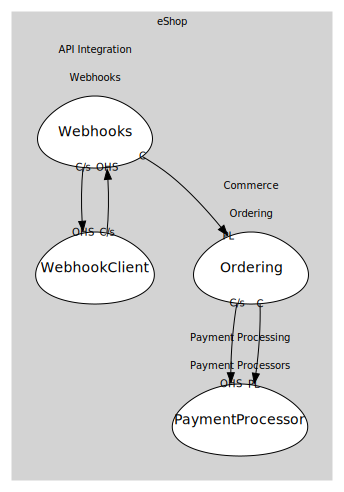

# Webhooks
Webhook registration and event delivery.

## Bounded Contexts

### [Webhooks](boundedcontexts/webhooks/index.md)
Register webhooks and deliver order events to subscribers.

### [WebhookClient](boundedcontexts/webhook_client/index.md)
Sample receiver app for incoming webhook deliveries.

## Relationships
| Consumer | Consumed As | Provider | Consumable | Provided As |
| --- | --- | --- | --- | --- |
| [WebhookReceiver](boundedcontexts/webhook_client/services/webhook_receiver/index.md) | customer-supplier | WebhooksService | RegisterWebhook | open-host-service |
| [WebhooksService](boundedcontexts/webhooks/services/webhooks_service/index.md) | conformist | OrderingService | OrderPaid | published-language |
| [OrderingService](../../../commerce/subdomains/ordering/boundedcontexts/ordering/services/ordering_service/index.md) | customer-supplier | PaymentService | ProcessPayment | open-host-service |
| [OrderingService](../../../commerce/subdomains/ordering/boundedcontexts/ordering/services/ordering_service/index.md) | conformist | PaymentService | PaymentSucceeded | published-language |
| [WebhooksService](boundedcontexts/webhooks/services/webhooks_service/index.md) | customer-supplier | WebhookReceiver | ReceiveWebhook | open-host-service |
	
	
