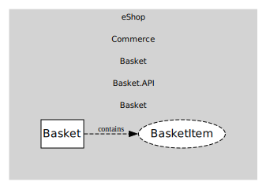

# Basket
Customer basket.

## Entities and Value Objects
| Type | Name | Description |
| --- | --- | --- |
| Entity (Root) | **Basket** | Basket root with items and user ownership. |
| Value Object | BasketItem | ProductId, quantity, unit price snapshot. |

## Relationships
| Source | Description | Target | Relation |
| --- | --- | --- | --- |
| [Basket](entities/basket/index.md) | contains | Basket - BasketItem | uses |

## Invariants
> No invariants.

## Provides
> No consumables.

## Consumes
> No consumptions.
	
