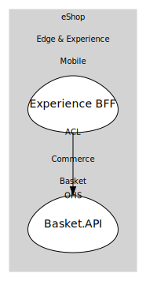

# Basket.API
Basket service (gRPC/HTTP) to manage user baskets.

## Aggregates

### [Basket](aggregates/basket/index.md)
Customer basket.

	
## Services

### [BasketService](services/basket_service/index.md)
Basket application service.

## Relationships
| Consumer | Consumed As | Provider | Consumable | Provided As |
| --- | --- | --- | --- | --- |
| [ShoppingBff](../../../../../edge_&_experience/subdomains/mobile/boundedcontexts/experience_bff/services/shopping_bff/index.md) | anti-corruption-layer | BasketService | GetBasket | open-host-service |
| [ShoppingBff](../../../../../edge_&_experience/subdomains/mobile/boundedcontexts/experience_bff/services/shopping_bff/index.md) | anti-corruption-layer | BasketService | AddItem | open-host-service |
| [ShoppingBff](../../../../../edge_&_experience/subdomains/mobile/boundedcontexts/experience_bff/services/shopping_bff/index.md) | anti-corruption-layer | BasketService | ClearBasket | open-host-service |

