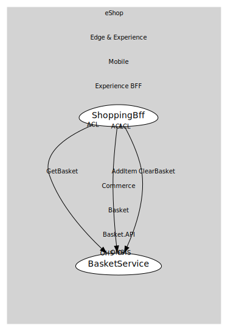

# BasketService
Basket application service.

## Provides

### (operation) - GetBasket [open-host-service]
Fetch basket by user.

### (operation) - AddItem [open-host-service]
Add/merge an item into basket.

### (operation) - ClearBasket [open-host-service]
Remove all items from basket.

## Consumes
> No consumptions.
	
