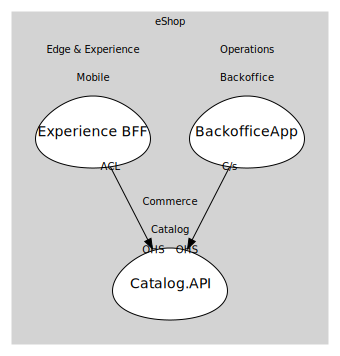

# Catalog.API
Minimal API for catalog queries and management.

## Aggregates

### [CatalogItem](aggregates/catalog_item/index.md)
Sellable product item.

	
## Services

### [CatalogService](services/catalog_service/index.md)
Catalog application service (HTTP).

## Relationships
| Consumer | Consumed As | Provider | Consumable | Provided As |
| --- | --- | --- | --- | --- |
| [ShoppingBff](../../../../../edge_&_experience/subdomains/mobile/boundedcontexts/experience_bff/services/shopping_bff/index.md) | anti-corruption-layer | CatalogService | GetCatalogItems | open-host-service |
| [Backoffice](../../../../../operations/subdomains/backoffice/boundedcontexts/backoffice_app/services/backoffice/index.md) | customer-supplier | CatalogService | ChangePrice | open-host-service |

